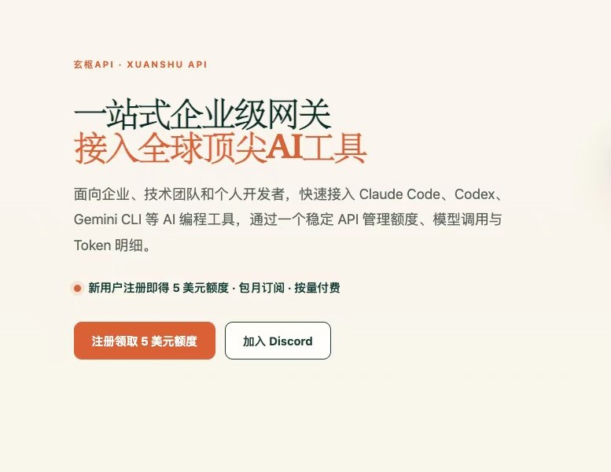

    <h1>Awesome AI Tools</h1>
    
     
    
    
    

[English](README.md) | 中文

**这个仓库收集整理AI相关的实用工具，欢迎大家一起推荐更多实用的AI工具，[推荐参考模板](https://github.com/ikaijua/Awesome-AITools/issues/232)**

- [AI新闻动态](https://github.com/ikaijua/Awesome-AITools/discussions?discussions_q=is%3Aopen+label%3A%22AI+news%22)
- [赞助项目/赞赏支持](#赞助项目-赞赏支持)

## 💎 赞助商

  非常感谢赞助商的慷慨支持！

<table align="center" cellpadding="10" style="width:100%; border-collapse:collapse;">
  <tr align="center">
    <td width="500" valign="middle" align="center">
      
        
          
        【<b>“Doloffer”</b>--一站式数字订阅充值平台, 主营 GPT、Claude 等 AI多类数字服务会员正版订阅，9 折优惠码 AI8888，极速发货，售后无忧】
          
        
      
    </td>
  </tr>
  <tr align="center">
    <td width="500" valign="middle" align="center">
      
        
          
        【<b>玄枢API</b>是面向企业、技术团队和个人开发者的新一代 AI 模型路由网关，提供企业级稳定性的全球顶级模型（Claude, GPT, Grok等）一站式API 接入。充值享八折，模型2折起，注册送5美金，企业支持开票，点<a href="https://www.xuanshuapi.com/register?aff=AWESOME-AI-TOOLS&promo=AWESOME-AI-TOOLS" target="_blank">此链接</a>注册额外获赠5美金额度。】
          
        
      
    </td>
  </tr>
</table>

## 全部分类
- [ChatGPT及类似大语言模型AI助手](#chatgpt及类似大语言模型ai助手)
- [开源大语言模型](#开源大语言模型)
- [大语言模型排行榜](#大语言模型排行榜)
- [AI Agent](#ai-agent)
- [Agent Skills](#agent-skills)
- [AI 新闻与资讯](#ai-新闻与资讯)
- [AI Coding](#ai-coding)
- [通用 LLM 应用](#通用-llm-应用)
- [办公协作CLI/MCP](#办公协作climcp)
- [AI金融与量化投资](#ai金融与量化投资)
- [AI图像创作与UI设计](#ai图像创作与ui设计)
- [AI视频创作](#ai视频创作)
- [AI云平台](#ai云平台)
- [GPU编程](#gpu编程)
- [LLM Prompts](#llm-prompts)
- [大语言模型训练-评估平台](#大语言模型训练-评估平台)
- [LLM 推理与部署](#llm-推理与部署)
- [阅读](#阅读)
- [写作](#写作)
- [翻译工具](#翻译工具)
- [语音识别-生成字幕](#语音识别-生成字幕)
- [文字转语音](#文字转语音)
- [音乐识别](#音乐识别)
- [变声软件](#变声软件)
- [声音克隆](#声音克隆)
- [语音翻译](#语音翻译)
- [语音合成](#语音合成)
- [语音处理](#语音处理)
- [AI生成音乐-音效](#ai生成音乐-音效)
- [视频翻译](#视频翻译)
- [学术科研](#学术科研)
- [OCR图像识别文字](#ocr图像识别文字)
- [视频内容总结](#视频内容总结)
- [AI检测器](#ai检测器)
- [人形机器人](#人形机器人)
- [具身智能与仿真](#具身智能与仿真)

## 精选文章
- [chatgpt相关文章](#chatgpt相关文章)

### ChatGPT及类似大语言模型AI助手
| 名称 | 说明 | 链接 | 费用 |
| --- | --- | --- | --- |
| Claude | 🌟 Anthropic 研发的 AI 助手，当前最强模型：**Claude Opus 5**。**核心差异：** Cowork 模式把 AI 从“聊天机器人”变成可拉取数据、生成 Excel 预测模型并执行工作流的代理；在编程、长上下文、安全性和企业场景上最强。 | [URL](https://claude.ai/) | 免费/付费 |
| ChatGPT | 🌟 OpenAI 的 AI 助手，当前最强模型：**GPT-5.6 Sol**。**核心差异：** 持久记忆和用户画像 —— 跨会话记住你的偏好，续聊最自然；通用能力最均衡，适合日常、编程和创意写作。 | [URL](https://chatgpt.com) | 免费/付费 |
| 豆包 | 🌟 字节跳动的 AI 助手，当前最强模型：**Doubao-Seed-2.1 Pro**。**核心差异：** 字节生态入口 + 多模态交互 —— 集成搜索、语音、音乐等能力，界面直观，适合日常通用问答。 | [URL](https://www.doubao.com/) | 免费 |
| Gemini | Google 的 AI 助手，当前最强模型：**Gemini 3.6 Flash**。**核心差异：** 原生多模态 + Deep Research —— 图像理解/生成和网络深度研究最强；与 Google Drive、Workspace 无缝集成。 | [URL](https://gemini.google.com/) | 免费/付费 |
| 通义千问 | 阿里云的 AI 助手，当前最强模型：**Qwen3.8-Max**。**核心差异：** 开源权重 2.4T MoE + 长链路 Agent 推理 —— 支持 100 万超长上下文、原生多模态和深度研究。 | [URL](https://chat.qwen.ai/) | 免费 |
| 腾讯元宝 | 腾讯的 AI 助手，当前最强模型：**混元 Hy3**。**核心差异：** 混元 + DeepSeek 双模型 —— 可切换腾讯自研混元 Hy3 和 DeepSeek R1；依托腾讯生态，适合中文搜索和内容创作。 | 1. [腾讯元宝智能助手](https://hunyuan.tencent.com/bot) 2. [混元 AI Studio](https://hunyuan.tencent.com/) | 免费 |
| DeepSeek | DeepSeek 的 AI 助手，当前最强模型：**DeepSeek-V4-Pro**（含 V4-Pro-Max 推理模式）。**核心差异：** 推理性价比 —— Pro-Max 是当前开源模型中编码与智能体能力最强；V4-Pro 提供 1M 上下文与原生多模态，API 价格极低。 | [URL](https://chat.deepseek.com/) | 免费/付费 |
| 月之暗面的 Kimi Chat | Moonshot AI 的 AI 助手，当前最强模型：**Kimi K3**。**核心差异：** 2.8T MoE + 100 万 token 超长上下文 —— 面向软件工程、知识工作和深度推理。 | 1. [kimi](https://kimi.moonshot.cn/) 2. [Moonshot AI 开放平台](https://platform.moonshot.cn/) | 免费 |
| 智谱AI | 智谱 AI 的 AI 助手，当前最强模型：**GLM-5.2**。**核心差异：** High/Max 双档思考深度 —— 可在快速回答和深度推理之间切换；专注 Agentic 编程和仓库级分析。 | 1. [URL](https://chat.z.ai/) 2. [API 开发者网站](https://open.bigmodel.cn/) | 免费/付费 |
| Minimax | MiniMax 的 AI 助手，当前最强模型：**MiniMax-M3**。**核心差异：** 长文本 + 多模态 Agent —— 支持超长上下文和语音/文本混合交互，适合内容创作和复杂任务。 | [URL](https://www.minimax.io/) | 免费/付费 |
| Grok | xAI 的 AI 助手，当前最强模型：**Grok 4.6**。**核心差异：** 实时 X 数据访问 —— 可直接调用 X 帖子作为信息源，实时新闻和事件跟踪能力强。[入门介绍](docs/grok/README-CN.md) | [URL](https://x.com/i/grok) | 免费/付费 |

### 开源大语言模型
| 名称 | 说明 | 链接 | 费用 |
| --- | --- | --- | --- |
| Kimi K3 | 🌟 月之暗面（Moonshot AI）2.8 万亿参数旗舰开源权重模型，原生支持视觉理解，100 万 token 上下文，基于 Kimi Delta Attention（KDA）架构。全球首个 3 万亿参数级开源模型，完整权重已于 2026 年 7 月 27 日在 Hugging Face 发布，采用 Modified MIT 许可。 | [技术博客](https://www.kimi.com/blog/kimi-k3) [Hugging Face](https://huggingface.co/moonshotai/Kimi-K3) | 免费 |
| DeepSeek-V4 | 🌟 DeepSeek 第四代旗舰模型，MIT 许可、Hugging Face 开源权重。V4-Pro (1.6T MoE，激活 49B) 与 V4-Flash (284B MoE，激活 13B) 均支持 1M token 上下文与原生多模态。架构升级：混合注意力机制（CSA + HCA）将长上下文推理 FLOPs 降至 V3.2 的约 27%、KV 缓存降至约 10%；Manifold-Constrained Hyper-Connections（mHC）增强残差连接稳定性；Muon 优化器带来更快收敛。在 32T+ tokens 上预训练。两款模型均内置三档推理努力度——**Non-think**（快速）、**Think High**、**Think Max**，其中 **Pro-Max** 模式目前是开源模型中编码与智能体能力最强。 |[Hugging Face](https://huggingface.co/collections/deepseek-ai/deepseek-v4)|免费|
| DeepSeek-R1 |DeepSeek 的第一代推理模型 DeepSeek-R1-Zero 和 DeepSeek-R1。DeepSeek-R1-Zero 是一种通过大规模强化学习（RL）训练的模型，没有监督微调（SFT）作为初步步骤，在推理性能表现卓越。|[Github](https://github.com/deepseek-ai/DeepSeek-R1) |免费|
| DeepSeek-V3 |DeepSeek推出的大语言模型，MoE 模型，671B 参数，激活 37B，在 14.8T token 上进行了预训练。|[Github](https://github.com/deepseek-ai/DeepSeek-V3) |免费|
| Gemma 4 |Gemma 4 是 Google 最新发布的开源大语言模型系列，基于 Gemini 架构构建，提供更强的性能、更长的上下文窗口和更好的多语言支持。|[Github](https://github.com/google/gemma.cpp) |免费|
| Muse Glimmer | Meta 开源的 300 亿参数多模态本地智能体模型，采用 Apache 2.0 许可。支持约 13.1 万 token 上下文、文本/图像输入、工具调用，4-bit 量化后可在 24–32 GB 显存的消费级显卡上运行，并配备 DFlash 投机解码。由 Muse Spark 蒸馏而来。[入门介绍](docs/muse-glimmer/README-CN.md) | [Hugging Face](https://huggingface.co/meta-models/Muse-Glimmer-30B) | 免费 |
| Llama 3 | Llama3是Meta AI开发的开源的大型语言模型， 它是Llama 语言模型v3版本。 Llama3在线测试地址：[huggingface.co/Meta-Llama-3-70B-Instruct](https://huggingface.co/chat/models/meta-llama/Meta-Llama-3-70B-Instruct)|[GitHub](https://github.com/meta-llama/llama3) | 免费  |
| Mixtral-8x7B |法国人工智能初创公司 Mistral AI开源的一种具有开放权重的稀疏专家混合模型 (SMoE)，在大多数基准测试中都优于 Llama 2 70B 和 GPT-3.5  论文地址：https://arxiv.org/pdf/2401.04088.pdf  论文主页：https://mistral.ai/news/mixtral-of-experts/ |[Github](https://github.com/mistralai/mistral-src) |免费|
|grok-1|马斯克的xAI公司开源的大语言模型|[Github](https://github.com/xai-org/grok-1) |免费|
| Qwen3 |阿里云通义千问团队研发的大语言模型系列。Qwen3-2507 包含 Instruct 和 Thinking 系列，提供 235B-A22B、30B-A3B、4B 等版本，支持 256K 长上下文，部分场景支持 1M 输入。 | [Github](https://github.com/QwenLM/Qwen3) | 免费  |
| ChatGLM2-6B | 中英双语对话模型 ChatGLM-6B 的第二代版本 | [GitHub](https://github.com/THUDM/ChatGLM2-6B) | 免费|
| Phi-3| Phi-3是微软开发的开放式人工智能模型系列。Phi-3 模型是目前能力最强、最具成本效益的小型语言模型（SLM），在各种语言、推理、编码和数学基准测试中，其性能均优于相同大小和更大的模型。|[Github](https://github.com/microsoft/Phi-3CookBook) |免费|

### 大语言模型排行榜
| 名称 | 说明 | 链接 | 费用 |
| --- | --- | --- | --- |
|LMSYS Chatbot Arena Leaderboard|LMSYS Chatbot Arena 是一个用于大语言模型评估的众包开放平台。收集了超过 1,000,000 次人类成对比较，用 Bradley-Terry 模型对 LLM 进行排名，并以 Elo 标度显示模型评级。 B站视频：[量子位/1v1单挑90万轮之后，最强大模型是……](https://www.bilibili.com/video/BV1Qs421w7df/) |[URL](https://lmarena.ai/leaderboard) |免费|
|Artificial Analysis|Artificial Analysis 是一个提供 AI 模型和服务商比较及基准测试的资源平台，帮助用户在选择 AI 模型和服务提供商时做出明智决策。平台提供多种流行 AI 模型的比较数据，包括 OpenAI 的 GPT-4、Meta 的 Llama 3 和 Anthropic 的 Claude 系列，涵盖了响应速度、延迟和成本等性能指标。|[URL](https://artificialanalysis.ai/)|免费|
|LiveCodeBench|LiveCodeBench 是一个全面且无污染的 LLM 代码评估基准，它会持续收集新的问题。LiveCodeBench 尤其关注更广泛的代码相关功能，例如自我修复、代码执行和测试输出预测，而不仅仅是代码生成。 |[URL](https://livecodebench.github.io/leaderboard.html)|免费|
|StructEval|StructEval 是发表于 TMLR 2025 的评测基准与公开排行榜，用于评估 LLM 的结构化输出生成和转换，包含 2,035 个样例和 18 种文本及可渲染格式，并采用格式专用的结构与视觉检查。|[排行榜](https://tiger-ai-lab.github.io/StructEval/) [论文](https://openreview.net/forum?id=buDwV7LUA7) [Github](https://github.com/TIGER-AI-Lab/StructEval)|免费|
|BenchGecko|AI模型基准测试排行榜，跨供应商定价对比，AI经济仪表盘。追踪数千个AI模型、128个评估基准、数百个供应商。提供免费API和开放数据集。|[URL](https://benchgecko.ai/zh/)|免费|

### AI Agent
| 名称 | 说明 | 链接 | 费用 |
| --- | --- | --- | --- |
| Claude Code | 🌟 Anthropic 推出的 AI 编程智能体。支持终端 CLI、VS Code/Cursor/JetBrains IDE 插件、桌面 App 和 Web，基于 Claude 系列模型，具备长上下文代码理解、跨文件编辑、shell 命令执行、MCP 扩展、Skills/Hooks/子代理、CLAUDE.md 项目规则与自动记忆能力；支持 Remote Control，可从手机或浏览器继续本地会话。[入门介绍](docs/claude-code/README-CN.md) [对比](docs/COMPARISON-CN.md) |[URL](https://docs.anthropic.com/en/docs/claude-code/quickstart) [Github](https://github.com/anthropics/claude-code)  |免费|
| Codex | 🌟 OpenAI 推出的开源（Apache-2.0）终端编程智能体，使用 Rust 编写。支持终端 CLI、VS Code/Cursor/Windsurf 等 IDE 扩展、Codex App/桌面体验及 Codex Web 云端任务；可直接理解并修改代码，内置内核级沙箱、MCP、Skills/Plugins/Hooks、子代理，通过 ChatGPT relay 在手机/桌面/Web 之间同步活跃会话，并支持 Remote SSH 连接远程环境。[入门介绍](docs/codex/README-CN.md) [对比](docs/COMPARISON-CN.md) |[Github](https://github.com/openai/codex) |免费|
| Kimi Code | 🌟 月之暗面（Moonshot AI）推出的 AI 编程智能体 CLI，在终端中运行。可读取和编辑代码、执行 shell 命令、搜索文件、抓取网页，并根据反馈规划下一步。支持视频输入、AI 原生 MCP 配置、子代理、生命周期钩子以及 ACP 编辑器集成（Zed、JetBrains）。[入门介绍](docs/kimi-code/README-CN.md) [对比](docs/COMPARISON-CN.md) | [Github](https://github.com/MoonshotAI/kimi-code)  | 免费 |
| DeepSeek Harness | 🌱 DeepSeek 于 2026 年 8 月 13 日开源（MIT）的 agent harness（智能体运行时）。提供 CLI 与本地 Web UI（默认 127.0.0.1:3080），采用基于 Cordis 的“一切皆插件”架构，内置 40+ 一方子包（LLM、MCP、LSP、ACP、沙箱、Skills、子代理、会话、工具、计划、调度、Web、Shell 等），并提供中英双语的架构文档。当前为开发者预览版，预计会有不兼容更新。[入门介绍](docs/deepseek-harness/README-CN.md) | [Github](https://github.com/deepseek-ai/deepseek-harness)  | 免费 |
| Trae | 🌱 字节跳动推出的 AI 编程与工作智能体产品族。包含 Trae Code（终端 CLI Agent）、Trae IDE（含 IDE Mode 与 SOLO Mode）、Trae Work（Web/桌面/移动工作空间，支持 Code Mode 与 Work Mode 及云端任务）。覆盖从终端到 IDE 再到云端工作区的完整链路，支持自定义 Agent、MCP、规则与多模型。[入门介绍](docs/trae/README-CN.md) | [URL](https://www.trae.ai/) [Github](https://github.com/bytedance/trae-agent)  | 免费/付费 |
| Pi | earendil-works 开源（MIT）的自扩展 AI 编程智能体。采用 Monorepo 架构，包含 `pi-coding-agent`（交互式 CLI）、`pi-agent-core`（工具调用与状态管理）、`pi-ai`（统一多厂商 LLM API）、`pi-tui` 与遥测模块。内置插件化架构、供应链安全加固（精确锁定依赖、shrinkwrap、审计）以及沙箱方案（Gondolin、Docker、OpenShell）。[入门介绍](docs/pi/README-CN.md) | [Github](https://github.com/earendil-works/pi)  | 免费 |
| Qoder | 阿里云推出的 AI 智能编程助手与智能体产品族，主打“自主编程新范式”。通过多智能体协同、长时委派执行、记忆与知识引擎，与代码库和工具链深度连接，围绕真实任务持续完成理解、规划、执行、验证与迭代。产品包括 Qoder Desktop（自主开发工作台）、QoderWork（本地 AI 工作搭子）、QoderWake（数字员工）、Qoder CLI（终端原生编程搭档/智能体引擎）以及面向企业的 Cloud Agents 云端托管平台。[入门介绍](docs/qoder/README-CN.md) [对比](docs/COMPARISON-CN.md) | [URL](https://qoder.com.cn/) | 免费/付费 |
|Antigravity|Google 推出的以智能体为先的 AI 编程平台 Antigravity 2.0，提供独立桌面 App、IDE、终端 CLI（`agy`）和 SDK 四种形态，用于替代 Gemini CLI。围绕 Gemini 3.5/3.6 Flash 等模型，支持在 Editor / Manager 双视图中编排多个自主智能体，具备内置浏览器/终端、可核验 Artifacts（计划、截图、录屏）、子代理、Hooks 与定时任务。同时支持 Claude、GPT-OSS 等第三方模型。[入门介绍](docs/antigravity/README-CN.md)|[URL](https://antigravity.google/)|预览期免费|
| Grok build | xAI 推出的基于终端的 AI 编程智能体，开源且使用 Rust 编写。以全屏、支持鼠标交互的 TUI 形式运行，能理解代码库、编辑文件、执行 shell 命令、搜索网络并管理长时间运行的任务。支持交互式、无头（脚本/CI）以及嵌入 ACP 编辑器等模式，内置 MCP 服务器、技能、插件、钩子和沙箱。[入门介绍](docs/grok-build/README-CN.md) | [Github](https://github.com/xai-org/grok-build)  | 免费 |
| browser-use | 开源 Python 库，使 AI 智能体能够控制网页浏览器。支持自然语言任务执行、DOM 提取、表单填写、多步导航，并通过简单 API 与任意大模型集成。适用于构建网页智能体、自动化测试和数据提取工作流。[入门介绍](docs/browser-use/README-CN.md) | [GitHub](https://github.com/browser-use/browser-use)  | 免费 |
| Cua | 面向计算机使用代理 (Computer-Use Agents) 的开源基础设施。提供可在 macOS、Windows、Linux 和 Android 上运行的沙箱、驱动和 SDK，使 AI 能够像人类一样控制桌面并执行任务。[入门介绍](docs/cua/README-CN.md) | [GitHub](https://github.com/trycua/cua)  | 免费 |
|OpenClaw|开源的自托管 AI 智能体，可以在本地运行并自主执行任务。能够连接 WhatsApp、Telegram、Slack、Discord 等消息平台，控制浏览器，访问系统，具有持久记忆功能。由 Peter Steinberger 开发，是增长最快的开源项目之一。[入门介绍](docs/openclaw/README-CN.md)|[Github](https://github.com/openclaw/openclaw) |免费|
|OpenWorker|吴恩达（Andrew Ng）开源的本地优先桌面 AI 同事。以交付完整工作成果（文档、Slack 回复、日程更新、报告）为目标，而非仅提供聊天回答。支持 35+ 应用连接器、MCP 协议，可接入自有 API Key 的多种模型（OpenAI、Anthropic、Gemini、DeepSeek、Kimi、Qwen、Ollama 等），数据和凭证本地存储。[入门介绍](docs/openworker/README-CN.md)|[Github](https://github.com/andrewyng/openworker) |免费|
| WorkBuddy | 腾讯推出的全场景 AI 智能体桌面工作台（“腾讯龙虾”）。支持自然语言派活，自主规划并操作本地文件、Office、文件夹完成复杂办公任务；可接入微信、企业微信、QQ、飞书、钉钉，数据支持本地运算。 | [URL](https://www.codebuddy.cn/work/) | 免费/付费 |
| autoresearch | Karpathy 开源的自动化 AI 研究助手。它能够自主提出假设、修改训练代码并运行实验，通过不断迭代来寻找性能提升方案，是专为机器学习研究设计的自主 Agent。 | [Github](https://github.com/karpathy/autoresearch)  | 免费 |
| ml-intern | 由 Hugging Face 开发的开源自主 AI Agent，定位为专业机器学习工程师。它能够处理端到端的 ML 生命周期，包括研究论文、编写代码、运行实验以及将模型发布到 Hugging Face Hub。[入门介绍](docs/ml-intern/README-CN.md) | [Github](https://github.com/huggingface/ml-intern)  | 免费 |
| Dexter | 自主财务研究智能体，旨在通过思考、计划和迭代学习进行深度分析。专注于财务领域。[入门介绍](docs/dexter/README-CN.md) | [Github](https://github.com/virattt/dexter)  | 免费 |
| Multica | 开源托管代理平台，将 AI 编码代理（Claude Code, Codex, Cursor, Copilot, OpenCode, OpenClaw, Hermes, Gemini, Pi, Kimi, Kiro CLI 等）作为“一等公民”队友集成到开发团队中。支持任务分配、进度跟踪、技能复用，本地守护进程可自动检测已安装的 Agent CLI。[入门介绍](docs/multica/README-CN.md) | [Github](https://github.com/multica-ai/multica)  | 免费/付费 |
| Paperclip | 开源 AI 智能体编排平台，将 AI 运营建模为公司组织。可定义组织架构、汇报关系、预算和治理策略，让智能体在该结构内自主工作。支持 OpenClaw、Claude Code、Codex 等智能体后端。基于心跳机制执行，具备成本控制和审计追踪。[入门介绍](docs/paperclip/README-CN.md) | [Github](https://github.com/paperclipai/paperclip)  | 免费 |
| Symphony | OpenAI 开源的项目需求到交付的 harness。将项目需求转化为隔离、自主的实施运行；代理可监听 Linear 等看板，自动提交 PR、合并代码，并提供 CI 状态、审查反馈、演示视频等工作证明。目前处于工程预览阶段。[入门介绍](docs/symphony/README-CN.md) | [Github](https://github.com/openai/symphony)  | 免费 |
| QM | YC 开源的面向企业组织的 multi-agent harness，运行在 Slack 和 Web 上。以 scope（作用域）为每个员工、项目、频道隔离记忆、文件、凭据与权限；核心为 headless 架构，模型和 harness 可替换，支持 Docker/Fly/AWS 自托管。[入门介绍](docs/qm/README-CN.md) | [Github](https://github.com/yc-software/qm)  | 免费 |
| Buzz | Block 开源的可自托管人机协作工作空间，人类与 AI 智能体共享同一个房间。智能体拥有独立密钥和审计轨迹，可打开仓库、提交补丁、审查代码、运行工作流、编辑画布、加入语音讨论等。基于 Nostr relay 构建，每条消息和操作都是签名事件。[入门介绍](docs/buzz/README-CN.md) | [Github](https://github.com/block/buzz)  | 免费 |
|deer-flow|字节跳动开源的长时程 SuperAgent harness，可编排子代理、记忆、沙箱、工具、技能和消息网关，完成研究、编程与内容创作等长时间任务。基于 LangGraph/LangChain 构建，提供 Web UI 并支持多种大语言模型。[入门介绍](docs/deer-flow/README-CN.md)|[Github](https://github.com/bytedance/deer-flow) |免费|
| Orkas | 开源、本地优先的多智能体 AI 桌面客户端。Commander 会拆解目标，并协调拥有独立技能和记忆的专职 Agent 并行或串行工作。支持自带模型服务和本地模型端点，也可调用 Claude Code、Codex、OpenClaw、OpenCode 和 Hermes。跨平台支持 macOS、Windows 和 Linux。 | [官网](https://orkas.ai?source=github_awesome_aitools) [Github](https://github.com/Orkas-AI/Orkas)  | 免费 |
|microsoft/autogen|AutoGen 是一个开源编程框架， 用于构建人工智能Agent，并促进多个Agent之间的合作，以解决任务。 |[Github](https://github.com/microsoft/autogen) |免费|
|msitarzewski/agency-agents|开源AI代理工具包，包含230+个细分领域的专业代理角色，覆盖工程、设计、营销、销售、金融、游戏开发、医疗等。提供开箱即用的代理人设、工作流模板、可交付成果，以及原生桌面应用，可一键浏览/安装代理到 Claude Code、Cursor、Codex、Gemini、Kimi Code、Aider 等AI开发工具。[入门介绍](docs/agency-agents/README-CN.md)|[Github](https://github.com/msitarzewski/agency-agents) |免费|
| ECC | 面向 AI 编程代理的开源增强框架。为 Claude Code、Codex、Cursor、OpenCode、Gemini、Zed、GitHub Copilot 等提供统一的 Agent/技能/规则/Hook/MCP 配置体系。内置 60 个子代理、232 个技能、记忆持久化、AgentShield 安全扫描，附带桌面仪表盘 GUI。 | [Github](https://github.com/affaan-m/ECC)  | 免费 |
| CC Switch | 跨平台桌面应用，用于一站式管理 Claude Code, Codex, Gemini CLI, OpenCode 和 OpenClaw。提供可视化界面管理 API 供应商、MCP 服务器和技能，支持双向同步。[入门介绍](docs/cc-switch/README-CN.md) | [Github](https://github.com/farion1231/cc-switch)  | 免费 |
| codex-plugin-cc | Claude Code 插件，允许用户在 Claude Code 工作流中直接使用 OpenAI Codex 进行代码审查和任务委托。提供 /codex:review、/codex:adversarial-review 等命令 | [Github](https://github.com/openai/codex-plugin-cc)  | 免费 |
| codesight | CLI 令牌（token）优化器和 AI 上下文生成器，内置 MCP 服务器。扫描代码库以提取路由、架构、组件和依赖项，将 AI 上下文令牌减少 9 倍至 13 倍。支持 Claude Code、Cursor、Copilot、Codex 和 Windsurf。零运行时依赖。 | [Github](https://github.com/Houseofmvps/codesight)  | 免费 |
| AGENTS.md | 专门为 AI 编程智能体设计的代码库文档开放标准。通过提供结构化的上下文、指令和约束条件，帮助智能体更高效、更安全地工作。[入门介绍](docs/agents/README-CN.md) | [Github](https://github.com/agentsmd/agents.md)  | 免费 |
| Spec Kit | GitHub 开源的规格驱动开发（Spec-Driven Development）工具包。提供 `specify` CLI 以及 /speckit.specify、/speckit.plan、/speckit.implement 等斜杠命令，与 30+ AI 编程智能体集成，将产品需求规格转化为可执行的实现计划。 | [Github](https://github.com/github/spec-kit)  | 免费 |
| musistudio/claude-code-router | 一个强大的路由工具，可将Claude Code请求路由到不同模型并自定义任何请求。支持多提供商路由、请求/响应转换、动态模型切换、CLI模型管理和GitHub Actions integration。 |[Github](https://github.com/musistudio/claude-code-router) |免费|
|instructkr/claw-code|Anthropic Claude Code 代理框架的重新实现项目，目前正在用 Rust 重写以提升内存安全性。专注于构建更好的 AI 代理工具框架，采用合法合规的方式重新实现 |[Github](https://github.com/instructkr/claw-code) |免费|
|MemPalace|开源AI记忆系统，将完整对话和项目数据本地存储，无需依赖云端。采用"记忆宫殿"分层结构组织记忆，在 LongMemEval 基准测试中达到 96.6% 召回率（目前得分最高），支持 MCP 集成，可以配合本地大语言模型离线使用。|[Github](https://github.com/milla-jovovich/mempalace) |免费|
| TencentDB Agent Memory | 腾讯云开源的面向智能体团队的记忆基础设施。提供 Memory Hub 实现跨会话/跨 Agent 记忆共享，Chat Memory 通过 L0–L3 四层蒸馏保留上下文，Skill library 沉淀可复用技能，Wiki/CodeGraph 构建文档与代码知识图谱。支持与 Claude Code、CodeBuddy 等 Agent 集成。[入门介绍](docs/tencentdb-agent-memory/README-CN.md) | [Github](https://github.com/TencentCloud/TencentDB-Agent-Memory)  | 免费 |
| Hermes Agent | NousResearch 开发的开源 AI Agent 框架，基于 Hermes 系列模型构建，在工具调用和推理能力上进行了精细微调，用于构建自主 AI 智能体。 | [Github](https://github.com/NousResearch/hermes-agent)  | 免费 |
| Screenpipe | 开源的 24/7 本地屏幕和麦克风录制工具，具备 OCR、音频转录和语义搜索功能。通过 MCP 为 AI 智能体提供您所看、所说、所听内容的长期上下文。支持 Ollama 或任何本地大语言模型，完全离线运行。跨平台（macOS / Windows / Linux）。 | [Github](https://github.com/screenpipe/screenpipe)  | 免费 |
| FlowGram.AI | 字节跳动开源的可扩展可视化 AI 工作流开发框架，内置画布、表单引擎、变量作用链和现成物料（LLM、Condition、代码编辑器等），帮助开发者更快构建 AI 工作流平台。 | [Github](https://github.com/bytedance/flowgram.ai)  | 免费 |
| Conductor | 源自 Netflix 的开源 durable workflow engine，现聚焦 AI Agent 编排。提供事件驱动执行、持久化状态、重试/超时、14+ LLM 提供商、MCP 工具调用、function calling、人工审批以及面向 RAG 的向量数据库集成。在 Netflix、Tesla、LinkedIn、J.P. Morgan 生产环境使用。[入门介绍](docs/conductor/README-CN.md) | [Github](https://github.com/conductor-oss/conductor)  | 免费 |
| DeepTutor | 香港大学数据科学研究院（HKUDS）开源的 AI 原生学习/辅导工作区，整合 AI 辅导、解题、测验生成、研究、可视化和掌握式学习路径。支持多引擎 RAG、持久化记忆、Partner/智能体、以及 Claude Code/Codex 等编程 CLI 实时接入。[入门介绍](docs/deeptutor/README-CN.md) | [Github](https://github.com/HKUDS/DeepTutor)  | 免费 |
|Manus | Manus 是一款行动引擎，它不仅提供答案，还能执行任务、自动化工作流程并扩展您的服务范围 | [URL](https://manus.im/) | 免费试用/付费 |
| MiniMax Agent|Minimax的 Agent 助手|[URL](https://agent.minimaxi.com/)|免费/付费|
|agentscope|面向Agent的编程：构建大型语言模型应用程序。阿里开源|[Github](https://github.com/agentscope-ai/agentscope)|免费|
|Auto-GPT|开源项目，使用gpt自主地实现你设定的任何目标。演示示例：[爆火的自主人工智能AutoGPT，程序员表示开始真正有点担忧会失业了！](https://www.bilibili.com/video/BV1Ph4y1W7Yj)|[GitHub](https://github.com/Significant-Gravitas/Auto-GPT) |免费，需要OpenAI API key|
|CLI-Anything|香港大学开发的开源框架，让所有软件都能原生支持 AI 代理 —— 通过 7 阶段流水线为任意应用自动生成生产级 CLI，使 AI 代理能够控制任何桌面软件。支持 Claude Code、OpenClaw、Codex 等 16+ AI 代理平台，并包含 CLI-Hub 用于社区 CLI 发现和安装。|[Github](https://github.com/HKUDS/CLI-Anything) |免费|
|AnyGen|AnyGen 是一款真正能帮你”完成工作”的 AI 助手。从写作和分析到规划和报告，它能在几分钟内将你的想法转化为可直接使用的专业成果。[专为工作打造的 AI 助手](https://www.anygen.io/task/LkA2pg7EXaVJkrgETSol5DelgEd)|[URL](https://www.anygen.io/)|免费试用/付费|
| Understand Anything | 基于 AI 的代码库和知识库分析工具，构建交互式可视化知识图谱。支持多智能体分析、架构引导教程以及针对大型代码库的语义搜索。可作为 Claude Code、Cursor 等工具的插件使用。[入门介绍](docs/understand-anything/README-CN.md) | [Github](https://github.com/Lum1104/Understand-Anything)  | 免费 |
### Agent Skills
| 名称 | 说明 | 链接 | 费用 |
| --- | --- | --- | --- |
| anthropics/skills | Claude Code官方技能仓库，为Claude Code AI助手提供可复用的工具集成和扩展功能 | [Github](https://github.com/anthropics/skills)  | 免费 |
| openai/skills | OpenAI GPT模型官方技能仓库，为OpenAI的AI助手提供可复用的工具和扩展功能 | [Github](https://github.com/openai/skills)  | 免费 |
| skills.sh | 社区驱动的AI助手技能注册表与市场，为包括Claude Code、OpenAI GPT等各类大语言模型助手提供精选的可复用技能集合，提供所有技能的下载用量统计和热门趋势排行榜 | [网站](https://skills.sh/) | 免费/付费 |
| JimLiu/baoyu-skills | Claude Code社区技能仓库，提供包括微博发布功能在内的实用中文和地区特定技能 | [Github](https://github.com/JimLiu/baoyu-skills)  | 免费 |
| ClawHub | AI代理的快速技能注册中心，具备向量搜索功能。提供集中式的代理技能管理和发现平台。 | [URL](https://clawhub.ai/) | 免费/付费 |
| SkillHub | 腾讯推出的专为中国用户优化的AI技能社区，SkillHub 精选 Top 50 高质量 AI Skills，经过安全审核与多维度评估，助你发现最实用的 AI 技能。 | [URL](https://skillhub.tencent.com/) | 免费 |
| garrytan/gstack | 一套精心设计的 Claude Code 技能集，可将 AI 智能体转换为由专家组成的专项团队（CEO、产品经理、测试工程师、运维工程师）。增加了自定义斜杠命令和自动化质量检查功能。 | [Github](https://github.com/garrytan/gstack)  | 免费 |
| addyosmani/agent-skills | 由 Google Gemini 团队主管 Addy Osmani 开源的 20+ 标准化工程流程技能库。将资深工程师的开发规范封装成 AI 智能体可执行的技能，覆盖完整软件开发生命周期：从需求定义、规划、构建、验证、评审到发布。内置 7 个命令：/spec、/plan、/build、/test、/ship 等。兼容 Claude Code、Gemini CLI、Codex、Cursor。 | [Github](https://github.com/addyosmani/agent-skills)  | 免费 |
| phuryn/pm-skills | 面向产品经理的技能市场，适用于 Claude Code 和 Claude Cowork，提供产品发现、战略、执行、发布、增长以及 AI 辅助代码交付等场景的 PM 技能和串联工作流。 | [Github](https://github.com/phuryn/pm-skills)  | 免费 |
| NVIDIA/SkillSpector | NVIDIA 开源的 AI 代理技能安全扫描工具。可扫描来自 Git 仓库、URL、压缩包或本地目录的技能，检测提示注入、数据泄露、权限提升、恶意代码、供应链问题和 MCP 工具投毒等风险模式。结合静态分析与可选的 LLM 语义审查，可用于 CI/CD 或作为 MCP 服务器。 | [Github](https://github.com/NVIDIA/SkillSpector)  | 免费 |
| Superpowers | 面向编码代理的完整软件开发方法论，基于可组合技能构建。支持跨 Claude Code、Codex、Cursor、Kimi Code、OpenCode、Antigravity、GitHub Copilot CLI 和 Pi 强制执行规格驱动设计、TDD、系统调试、代码审查和子代理驱动开发。 [入门介绍](docs/superpowers/README-CN.md) | [Github](https://github.com/obra/superpowers)  | 免费 |
| last30days-skill | AI 智能体技能，可跨 Reddit、X、YouTube、Hacker News、Polymarket、GitHub、arXiv 和全网研究任意话题，并根据真实互动（点赞、转发、投注等）评分后合成带引用的总结。支持 Claude Code、Codex、Cursor、Gemini CLI 等 50+ Agent Skills 宿主。 | [Github](https://github.com/mvanhorn/last30days-skill)  | 免费 |
| Claude Video | 用于 Claude Code 的 Agent Skill，让 AI 能够"观看"视频：提取关键帧、获取字幕/转录文本，并基于画面和音频内容回答问题。支持 YouTube、TikTok、本地文件，以及通过 Agent Skills CLI 接入 50+ 智能体宿主。 | [Github](https://github.com/bradautomates/claude-video)  | 免费 |

### AI 新闻与资讯
| 名称 | 说明 | 链接 | 费用 |
| --- | --- | --- | --- |
| SemiAnalysis | 由 Dylan Patel 创办，专注于半导体、AI 硬件、GPU、数据中心及算力供应链的深度研究与分析。发布对 AI 行业有深入研究的长篇行业研报（部分免费，大部分需订阅）。 | [X](https://x.com/SemiAnalysis_)、[官网](https://semianalysis.com) | 免费/付费 |
| World Monitor | AI驱动的实时全球情报面板，聚合435+个精选信源，提供地缘政治监控、基础设施追踪、AI摘要、21种语言支持，可本地运行AI模型，支持全平台桌面端应用 | [Github](https://github.com/koala73/worldmonitor) 、[官网](https://worldmonitor.app) | 免费 |
| Prismix | AI 服务实时状态监控中心，聚合 75+ AI 服务（OpenAI、Anthropic、Grok、Cursor 等）的实时运行状态，提供来自 55+ 来源的精选 AI 新闻并支持个性化信息流，还包含 500+ MCP 服务器目录及告警功能。 | [官网](https://prismix.dev) | 免费/付费 |
| AI Weekly | 独立的 AI 新闻通讯，自 2015 年起每周 3 期，读者超过 44,000 名专业人士。聚焦真正重要的 AI 报道，由编辑单人策划。 | [官网](https://aiweekly.co) | 免费 |

### AI Coding
| 名称 | 说明 | 链接 | 费用 |
| --- | --- | --- | --- |
| mahonzhan/awesome-coding-plan|各厂家 Coding Plan 对比|[Github](https://github.com/mahonzhan/awesome-coding-plan)  |免费|
| Trae | 字节跳动推出的类似Cursor的AI编程IDE|[URL](http://trae.com.cn)|免费|
| Cursor | 🌟 使用 GPT进行协作的代码编辑器 | [URL](https://www.cursor.so) | 付费/免费试用 |
| GitHub Copilot | GitHub 和 OpenAI 合作开发的一个代码编写助手  [Github Copilot技巧和窍门](https://bilibili.com/video/BV1ic411T7Jd) | [URL](https://github.com/features/copilot)  | 付费 |
| OpenCode | 开源的终端原生 AI 编码 agent。不绑定特定厂商（支持 Anthropic、OpenAI、Google 及本地模型），采用 TUI 客户端/服务端架构，集成 LSP，支持自定义 agent 和 MCP 服务器。[入门介绍](docs/opencode/README-CN.md) | [URL](https://opencode.ai) [Github](https://github.com/anomalyco/opencode)  | 免费 |
| OpenChamber | OpenCode AI agent 的桌面/网页图形界面。在 OpenCode 之上提供会话管理、diff 查看和工作区控制。[入门介绍](docs/openchamber/README-CN.md) | [URL](https://openchamber.dev) [Github](https://github.com/openchamber/openchamber)  | 免费 |
| oh-my-pi | @can1357 维护的 Pi fork。终端原生 AI 编码 agent，深度集成 IDE 能力：LSP、DAP 调试器、Python/Bun 代码执行、40+ 模型提供商和 32 个内置工具。[入门介绍](docs/oh-my-pi/README-CN.md) | [Github](https://github.com/can1357/oh-my-pi)  | 免费 |
| Happy Coder | Codex和Claude Code的移动端和Web客户端，支持实时语音、加密和全功能 | [URL](https://happy.engineering) [GitHub](https://github.com/slopus/happy)  | 免费 |
| Termux | Android终端模拟器和Linux环境应用，可直接在移动设备上运行编码工具、AI模型和各类开发环境，内置SSH客户端支持登录远程主机。 | [Github](https://github.com/termux/termux-app)  | 免费 |
| AI-Codereview-Gitlab | 基于大模型(DeepSeek, OpenAI等)的 GitLab 自动代码审查工具；支持钉钉/企业微信/飞书推送消息和生成日报；支持Docker部署；可视化 Dashboard。 | [Github](https://github.com/sunmh207/AI-Codereview-Gitlab)  | 免费 |
| alibaba/open-code-review | 阿里巴巴开源的 AI 代码评审 CLI/Agent。基于确定性流水线与 LLM Agent 审查 Git diff，支持行级评论、OpenAI/Anthropic 兼容模型端点、自定义规则、JSON CI 输出、WebUI 会话查看，以及 Claude Code/Codex 集成。 | [Github](https://github.com/alibaba/open-code-review)  | 免费 |
| code-review-graph | 基于 Tree-sitter 构建代码结构图并增量追踪变更，通过 MCP 为 AI 编程助手提供精准的代码审查上下文，减少重复读取整个代码库。 | [Github](https://github.com/tirth8205/code-review-graph)  | 免费 |
| Cate | 开源桌面 IDE，基于无限缩放画布。可以把 Monaco 编辑器、xterm.js 终端、内嵌浏览器和 Claude Code 智能体面板自由排布在可缩放的空间里，代替传统的窗口和标签页。面板支持浮动、停靠或分离为独立窗口，布局按项目自动保存。基于 Electron 构建，支持 macOS、Windows 和 Linux。 | [URL](https://cate.cero-ai.com) [Github](https://github.com/0-AI-UG/cate)  | 免费 |
| CLIProxyAPI | 代理服务器，将各类 AI CLI 工具和订阅（Claude Code、Codex、Gemini、Grok 等）通过 OpenAI/Gemini/Claude/Codex 兼容的 API 接口暴露出来。支持 OAuth 登录、流式/WebSocket 响应、函数调用、多模态输入，以及跨多账号的负载均衡。 | [Github](https://github.com/router-for-me/CLIProxyAPI)  | 免费 |
| Markstream | 面向 AI 对话界面的开源流式 Markdown 渲染器家族，可处理未闭合 Markdown 并平滑展示 token 流。提供持续维护的 Vue 3/Nuxt、React/Next.js、Svelte、Angular、Vue 2 及框架无关的 parser/core 包，并支持 Mermaid、KaTeX、代码高亮、安全 HTML 与 SSR。 | [框架入口](https://markstream.simonhe.me/frameworks) [Vue 在线体验](https://markstream-vue.simonhe.me/) [Github](https://github.com/Simon-He95/markstream-vue)  | 免费 |
| Codex Security | OpenAI 开源的 CLI 与 TypeScript SDK，用于发现、验证并修复代码中的安全漏洞。支持仓库扫描、漏洞追踪、修复验证、CI/CD 集成以及容器化批量扫描。[入门介绍](docs/codex-security/README-CN.md) | [Github](https://github.com/openai/codex-security)  | 免费 |

### 通用 LLM 应用
| 名称 | 说明 | 链接 | 费用 |
| --- | --- | --- | --- |
| Google AI Studio|Google AI Studio 是一个基于 Web 的免费平台，允许开发者使用 Google 的大型语言模型（如 Gemini 3.6 Flash）进行原型设计和实验。它提供了一个易于使用的界面，你可以快速构建文本生成、代码生成、聊天机器人等应用。[可用的国家和地区](https://ai.google.dev/gemini-api/docs/available-regions#available_regions)  介绍：B站视频：[一枚卓子/Google AI Studio教程｜体验Gemini 3.6 Flash 模型，和它视频聊天，创造提示词机器人](https://www.bilibili.com/video/BV1ejkgYcEi5/)|[URL](https://aistudio.google.com/)|免费|
|Cherry Studio|Cherry Studio 是一款支持多个大语言模型（LLM）服务商的桌面客户端，兼容 Windows、Mac 和 Linux 系统。支持主流 LLM 云服务：OpenAI、Gemini、Anthropic、硅基流动等；集成了流行 AI Web 服务：Claude、Peplexity、Poe、腾讯元宝、知乎直答等；支持 Ollama、LM Studio 本地模型部署|[Github](https://github.com/CherryHQ/cherry-studio) |免费|
| Gemini Notebook（原 NotebookLM）|Google 推出的 AI 研究助手，原 NotebookLM。可将文本、视频、音频、数据集等文件转化为播客节目（Audio Overview），并生成常见问题解答、学习指南、目录、时间轴和简报等，支持基于来源的自由对话与事实核查。|[URL](https://notebook.google.com/)|免费|
| Learn about |谷歌开发的人工智能学习助手。它是一个会话式的学习伙伴，能适应您独特的好奇心和学习目标，帮助您掌握新主题并加深理解。|[URL](https://learning.google.com/experiments/learn-about)|免费|
| Poe | Quora 推出的多模型 AI 聊天平台。可通过单一界面和积分制订阅使用 GPT、Claude、Gemini、Grok、Kimi、DeepSeek 等众多文本/图像/视频模型。支持自定义 Bot、群聊、多模型对比和 OpenAI 兼容 API。 | [URL](https://poe.com/) | 免费/付费 |
| NoteGPT|NoteGPT 是一款智能笔记工具，它可以记录、转录并总结各种内容，比如会议、讲座、播客、YouTube 视频、B站视频、新闻简报和文章等。|[URL](https://notegpt.io/)|免费/付费|
| HuggingChat|Hugging Face 的开源聊天应用程序 Hugging Chat. [URL](https://huggingface.co/chat/)|[Github](https://github.com/huggingface/chat-ui) |免费|
| ollama | 在本地环境中轻松运行和管理大型语言模型，如Llama 、Mistral、Gemma2等|[Github](https://github.com/ollama/ollama)  |免费|
|langchain|是一个强大的框架，旨在帮助开发人员使用语言模型构建端到端的应用程序。它提供了一套工具、组件和接口，可简化创建由大型语言模型 (LLM) 和聊天模型提供支持的应用程序的过程。LangChain 可以轻松管理与语言模型的交互，将多个组件链接在一起，并集成额外的资源，例如 API 和数据库。|[Github](https://github.com/langchain-ai/langchain) |免费|
|anything-llm|开源的文档聊天机器人解决方案|[Github](https://github.com/Mintplex-Labs/anything-llm) |免费|
| screenshot-to-code | 将截图、设计稿、Figma 设计和屏幕录制转换为干净的功能代码。支持多种 AI 模型（Gemini 3 Flash、GPT-5.5、Claude Opus 4.8）和输出框架（HTML+Tailwind、React、Vue、Bootstrap 等）。还支持 URL 克隆和视频转代码功能。 | [GitHub](https://github.com/abi/screenshot-to-code) | 免费，需要 API 密钥（推荐 OpenAI/Anthropic/Gemini）|
|together.ai chat|与 HuggingChat 类似，可选择不同的开源模型，支持 DeepSeek R1、LLaMA、QWen 和 Flux Schnell。每天 60 条免费信息。|[URL](https://chat.together.ai/)|免费/付费|
|OpenRouter| 集成了 400 余种 AI 模型（OpenAI、Anthropic、Google、Mistral 等）的统一 API 网关。零加价定价，推理流量仅收取 5% 服务费，支持智能路由 / 故障转移|[URL](https://openrouter.ai/)| 免费/付费 |
| IMA |腾讯推出的 AI 智能工作台，集成搜索、阅读、写作、知识库管理等功能。搜索覆盖微信公众号文章，支持上传本地文件、公众号文章或网页链接构建个人知识库。内置模型支持 DeepSeek-V4-Flash、GLM-5.2 和混元 Hy3。|[URL](https://ima.qq.com/) |免费|

### 办公协作CLI/MCP
| 名称 | 说明 | 链接 | 费用 |
| --- | --- | --- | --- |
| Chrome DevTools MCP | Chrome DevTools 官方提供的 Model Context Protocol 服务器，让 AI 编程智能体（如 Claude Code、Gemini CLI）能够控制和检查正在运行的 Chrome 浏览器，支持性能追踪分析、网络请求调试、截图捕获和控制台日志查看，帮助 AI 更好地运行、测试和调试代码。 | [Github](https://github.com/ChromeDevTools/chrome-devtools-mcp)  | 免费 |
| Lightpanda | 用 Zig 编写的高性能、轻量级无头浏览器，专为 AI 智能体设计。速度比 Chrome 快约 9 倍，内存占用极低。原生支持 MCP 协议，并能直接输出适合 LLM 的 Markdown 格式。[入门介绍](docs/lightpanda/README-CN.md) | [Github](https://github.com/lightpanda-io/browser)  | 免费 |
| bb-browser | 使 AI 智能体能够控制您的真实 Chrome 浏览器会话，利用现有的登录状态访问网站，无需 API。 | [Github](https://github.com/epiral/bb-browser)  | 免费 |
| Google Workspace CLI | 社区构建的 Google Workspace 非官方命令行工具，统一访问所有 Google Workspace API，包括 Drive、Gmail、Calendar、Sheets、Docs、Chat 等。内置 40+ AI 代理技能，结构化 JSON 输出非常适合 AI 代理使用，支持多种认证方式。 | [Github](https://github.com/googleworkspace/cli)  | 免费 |
| 飞书 CLI | 飞书官方命令行工具，帮助开发者快速开发和管理飞书应用 | [Github](https://github.com/larksuite/cli)  | 免费 |
| 钉钉 CLI | 钉钉官方命令行工具，帮助开发者快速开发和管理钉钉应用 | [Github](https://github.com/DingTalk-Real-AI/dingtalk-workspace-cli)  | 免费 |
| 企业微信 CLI | 企业微信开源命令行工具，帮助开发者快速开发和管理企业微信应用 | [Github](https://github.com/WecomTeam/wecom-cli)  | 免费 |
| OpenConnector | 面向 AI 智能体的开源连接网关。用户一次性授权应用账号后，即可通过 SDK、CLI、MCP、HTTP 和 OpenAPI 向智能体提供 1000+ SaaS 服务的统一目录。 | [Github](https://github.com/oomol-lab/open-connector)  | 免费 |

### AI金融与量化投资
| 名称 | 说明 | 链接 | 费用 |
| --- | --- | --- | --- |
|TradingAgents|一个多智能体大语言模型金融交易框架，模拟真实世界交易公司的运作。它使用专门的 AI 智能体（基本面、情绪、技术和新闻分析师）通过结构化辩论协作评估市场状况并辅助交易决策。|[Github](https://github.com/TauricResearch/TradingAgents) |免费|
|VNPy|基于 Python 的全功能开源量化交易框架，支持策略回测、多交易所实盘交易，并集成 AI/大语言模型能力用于金融市场分析和策略开发，是国内量化交易者广泛使用的系统。|[Github](https://github.com/vnpy/vnpy) |免费|
|TimesFM|Google Research 开源的预训练时间序列基础模型，专门用于时间序列预测。支持长上下文（16k）和最长 1k 步的长区间预测，广泛应用于金融和量化投资预测场景。|[Github](https://github.com/google-research/timesfm) |免费|
| Dexter | 自主财务研究智能体，旨在通过思考、计划和迭代学习进行深度分析。专注于财务领域。[入门介绍](docs/dexter/README-CN.md) | [Github](https://github.com/virattt/dexter)  | 免费 |
| yfinance | 开源的 Python 库，用于获取 Yahoo Finance 数据。无需 API 密钥即可获取股票、ETF 和加密货币的历史价格数据。是 AI 量化交易和金融分析的重要数据源。 | [Github](https://github.com/ranaroussi/yfinance)  | 免费 |
| OpenBB | 开源投资研究平台，整合多个金融数据源（Yahoo Finance、Alpha Vantage 等）提供统一 API。内置 MCP 服务器支持 AI 智能体集成，让 Claude 等大语言模型可直接查询金融数据。 | [Github](https://github.com/OpenBB-finance/OpenBB)  | 免费 |
| AkShare | 开源的 Python 金融数据库，提供股票、期货、期权等金融数据接口。主要覆盖中国市场，是 AI 量化交易和金融分析的重要数据源。 | [Github](https://github.com/akfamily/akshare)  | 免费 |
| Fincept Terminal | 基于 C++20 + Qt6 的原生金融终端（内嵌 Python），集成 100+ 数据源、37 个面向交易/投资/经济/地缘政治的 AI Agent、多资产量化分析、16 家券商实时交易及 MCP 工作流。注意：公开版自 2026 年 6 月起改为每月更新，团队重心转向私有订阅版。 | [Github](https://github.com/Fincept-Corporation/FinceptTerminal)  | 免费/商业许可 |

### AI图像创作与UI设计
| 名称 | 说明 | 链接 | 费用 |
| --- | --- | --- | --- |
| ChatGPT Images 2.0 |OpenAI最新的图像生成模型 GPT Image 2.0。先进的AI图像生成和编辑能力。|[URL](https://chatgpt.com/images)|免费/付费|
| 豆包 | 字节跳动旗下的AI图像创作助手，支持文生图、图生图等多种功能 |[URL](https://www.doubao.com/) |免费/付费|
| Nano Banana/Nano Banana Pro|谷歌用于图像生成与编辑的先进人工智能模型。在LMArena文本转图像和图像编辑排行榜中位列榜首。  [Nano Banana 的用法合集](https://github.com/ikaijua/Awesome-AITools/wiki/Nano-Banana-%E7%9A%84%E7%94%A8%E6%B3%95%E5%90%88%E9%9B%86)  在线网站：  1. [aistudio](https://aistudio.google.com/prompts/new_chat?model=gemini-3.1-flash-image-preview)   2. [gemini](https://gemini.google.com/app)   3. [lmarea.ai](https://lmarena.ai/?mode=direct&chat-modality=image)|[URL](https://aistudio.google.com/prompts/new_chat?model=gemini-3.1-flash-image-preview) |免费/付费|
| Grok Image | xAI 的图像生成模型（Aurora），集成在 Grok 和 X 中，以写实风格和 meme 图像见长。 | [URL](https://grok.com/imagine) | 免费/付费 |
| Stitch | Google Labs 推出的 AI 驱动 UI 设计工具，主打“氛围设计（vibe design）”。支持通过文字提示、草图或语音生成高保真多屏原型、设计系统和前端代码，可导出到 Figma 或 Google AI Studio，并提供 MCP Server 与 SDK 供编码代理调用。[入门介绍](docs/stitch/README-CN.md) | [官网](https://stitch.withgoogle.com/) | 免费 |
|Z-Image|Z-Image是阿里巴巴通义实验室（Tongyi Lab）于近期开源的一款高性能图像生成模型。它主打“极速”与“高质量”的平衡，非常适合需要快速出图的场景。Z-Image-Turbo在线demo: https://huggingface.co/spaces/mrfakename/Z-Image-Turbo|[Github](https://github.com/Tongyi-MAI/Z-Image) |免费|
| 即梦AI|字节跳动旗下的文生图、AI视频生成和AI图片编辑应用|[URL](https://jimeng.jianying.com/ai-tool/home)|免费/付费|
| Midjourney | 输入文字或图片进行图片创作。应用示例：  [尝试用chatGPT+midjourney进行科研绘图，被效果震惊到了。。。](https://www.bilibili.com/video/BV1XM411T7uP) | [URL](https://www.midjourney.com) | 付费 |
| Stable diffusion webui | 开源项目，输入文字或图片进行图片创作， Stable diffusion webui是Stable diffusion的GUI是将stable diffusion实现可视化的图像用户操作界面，它本身还集成了很多其它有用的扩展脚本。 新手入门教程：https://www.bilibili.com/video/BV1Qo4y167AK/   AI风格化视频或AI真人视频的效果： 1. [【AI动画】欣小萌天台蹦迪 动画版](https://www.bilibili.com/video/BV1RL411U7wR)， 2. [死磕真人AI动作，人物和背景的终于不闪了，你们觉得哪个更好点？](https://www.bilibili.com/video/BV1Fs4y1V7f7) 3. [5分钟，教会你如何生成AI动画](https://www.bilibili.com/video/BV13s4y1D7Ni)| [GitHub](https://github.com/AUTOMATIC1111/stable-diffusion-webui) | 免费|
| Photoshop 生成式AI功能| 在Adobe Photoshop中使用生成式AI填充功能。功能介绍：  1. [B站视频：Photoshop 革命性新功能-生成式填充功能介绍](https://www.bilibili.com/video/BV1su411Y79Z/)   2. [巫师后期B站视频：引爆点——Photoshop核弹级更新（创成式AI填充）彻底改变图片行业！](https://www.bilibili.com/video/BV1qo4y1E7tK)| [URL](https://www.adobe.com/products/photoshop/generative-fill.html) |Photoshop 订阅会员可下载Beta版本试用|
| firefly |Adobe 的AI图片处理网站|[URL](https://firefly.adobe.com/)|免费/付费|
| clipdrop | stability.ai 公司旗下的图像处理网站，包含文生图、AI扩图、图生图、去除背景等功能 | [URL](https://clipdrop.co/)| 免费/ 付费|
| civitai | Civitai(C站)是一个用于分享AI图像创作模型资源的网站平台，拥有大量模型，已成为SD开源社区主要的模型交流场所 |[URL](https://civitai.com/)|免费|
| 通义万相 | 阿里旗下的文生图和AI图片创作应用| [URL](https://wanxiang.aliyun.com/) | 免费 |
| ideogram.ai | AI 文字生成图片的网站。前谷歌AI绘画4位大牛创立的公司推出的产品 | [URL](https://ideogram.ai/) | 免费 |
| Skybox AI | 输入文字生成360度全景图片 | [URL](https://skybox.blockadelabs.com/)| 免费/ 付费|
| Nero AI | AI图片放大、修复划痕、AI图片上色、AI图片去噪、AI一键抠图换背景、AI神奇擦除笔、AI写真；[介绍](https://github.com/ikaijua/Awesome-AITools/issues/100)。API文档：https://ai.nero.com/ai-api/docs/|[URL]( https://ai.nero.com/)|付费/试用|
| remove.bg |一键删除图片背景|[URL](https://www.remove.bg/)|免费/付费|
|ControlNet|能够在一个text2image上训练的扩散模型进行高效finetune，并且结合特定的condition输入，得到可控的效果|[Github](https://github.com/lllyasviel/ControlNet) |免费|
|black-forest-labs/flux2|FLUX.2 模型的官方推理资源库|[Github](https://github.com/black-forest-labs/flux2) |免费|
| Topaz Photo AI | 面向摄影师的AI图像增强套件，集成图像放大、降噪、锐化、人脸修复等功能，本地桌面端运行 |[URL](https://www.topazlabs.com/topaz-photo-ai)|付费/试用|

### AI视频创作
| 名称 | 说明 | 链接 | 费用 |
| --- | --- | --- | --- |
| Seedance | 🌟 字节跳动的视频生成模型系列。当前 Seedance 2.5 驱动了即梦 / 小云雀等产品，支持 30 秒单次生成、最高 4K 输出、最多 50 个多模态参考输入、文生视频、图生视频、首尾帧条件控制与局部编辑，并通过火山引擎对开发者开放。[介绍](docs/seedance/README-CN.md) / [Skills](docs/seedance/README-CN.md#agent-skills) | [URL](https://dreamina.capcut.com/) | 免费/付费 |
| 小云雀 |小云雀app是由字节跳动旗下剪映推出的AI视频和图片创作助手,支持AI智能成片、数字人视频、AI设计、AI换背景等多种功能，可以免费试用 Seedance 2.5, [Seedance 2.5专题](https://github.com/ikaijua/Awesome-AITools/discussions/266) |[URL](https://xyq.jianying.com/) |试用积分/付费|
| 豆包 | 字节跳动旗下的AI视频创作助手，支持文生视频、图生视频、数字人视频等多种功能 |[URL](https://www.doubao.com/) |免费/付费|
| 即梦AI|字节跳动旗下的文生图、AI视频生成和AI图片编辑应用|[URL](https://jimeng.jianying.com/ai-tool/home)|免费/付费|
| 剪映 |字幕生成语音、语音生成字幕、字幕翻译、一键图文成片，还有很便捷、强大的视频剪辑功能 识别字幕是vip功能|[URL](https://www.capcut.cn/)|免费/付费|
| 通义万相 | 阿里旗下AI图片和视频创作应用| [URL](https://tongyi.aliyun.com/wanxiang/videoCreation) | 免费/付费 |
| 海螺AI| Minimax的AI视频生成平台|[URL](https://hailuoai.com/video)|免费/付费|
| 快手可灵|支持文生视频和图生视频、首尾帧、动作控制功能|[URL](https://kling.kuaishou.com/)|免费/付费|
| PixVerse | 利用文本和照片创建令人惊叹的人工智能视频 |[URL](https://app.pixverse.ai/)|付费/试用|
| 腾讯混元AI视频|文生视频、图生视频功能；对口型和动作驱动功能：可以通过上传照片和音频或选择动作模版生成视频; 需要排队|[URL](https://video.hunyuan.tencent.com/)|免费|
| Dream Machine|由 Luma AI 提供。Dream Machine 是一个人工智能模型，能根据文本和图像快速制作出高质量、逼真的视频。[官方介绍视频](https://www.youtube.com/watch?v=Zb3tffmBPRE)|[URL](https://lumalabs.ai/dream-machine)|免费/付费|
| Runway | Gen-2: 文本/图像 AI生成视频   Gen-1: 根据视频AI生成视频  应用示例：  [B站视频：数字生命卡兹克/我用AI做了一部《流浪地球3》的预告片](https://www.bilibili.com/video/BV1hF411f7rg)  精选视频：https://runwayml.com/staff-picks | [URL](https://runwayml.com/) | 免费试用/付费|
| MOKI |美图的AI短片创作工具|[URL](https://www.moki.cn)| 免费试用/付费|
| Pika | 文本/图像 AI生成视频| [URL](https://pika.art/home)| 免费试用/付费|
| krea.ai| 提供文生图/视频、图片放大、模型训练等功能，Krea ai想做视频和图片界的 POE，目前集成了海螺、luma、Runway和可灵四家最好的视频生成模型。|[URL](https://www.krea.ai/)|免费试用/付费|
| HeyGen | 根据文字生成数字人的配音视频 | [URL](https://app.heygen.com/) | 免费试用/付费 |
|vivago.ai/video| 文本/图像生成视频; 4K视频增强|[URL](https://vivago.ai/video)| 免费|
| Palmier Pro | 面向 AI 构建的开源 macOS 视频编辑器。结合专业时间线剪辑、AI 辅助工作流，以及 Seedance、Kling、Nano Banana Pro 等生成式图像/视频能力；支持 MCP，可让 Claude Code、Codex、Cursor 或内置 Agent 控制视频时间线。仅支持 Apple Silicon Mac。 | [Github](https://github.com/palmier-io/palmier-pro)  | 免费/付费 |
| Topaz Video AI | AI视频增强、放大、去隔行、稳定、补帧、运动去模糊等专业视频修复工具，本地桌面端运行 |[URL](https://www.topazlabs.com/topaz-video-ai)|付费/试用|
| OpenMontage | 开源的 Agentic 视频制作系统。将 AI 编程助手变成完整的视频工作室，提供 12 种制作流程（讲解视频、动画、纪录片蒙太奇等）、100+ 工具、提供商评分、预算治理和质量关卡。支持 Claude Code、Cursor、Codex、Windsurf 和 Copilot。 | [Github](https://github.com/calesthio/OpenMontage)  | 免费/付费 |

### AI云平台
| 名称 | 说明 | 链接 | 费用 |
| --- | --- | --- | --- |
| Together AI |Together AI是一个专为生成式AI设计的云平台，提供了从模型推理、微调到GPU集群部署等多种服务。相比其他传统云平台，Together AI 主要聚焦于高效处理开源生成式模型，并为开发者和企业提供更灵活、定制化的解决方案。Together AI 支持多个开源模型，包括 LLaMA、Falcon、FLUX1 等。这些模型覆盖了从自然语言处理、对话系统到代码生成等多个领域，满足了不同场景下的应用需求。用户可以直接调用这些模型，也可以上传自己的数据进行微调，提升模型在特定任务中的表现。 文章介绍:  [Together AI是一个生成式AI服务平台](https://mp.weixin.qq.com/s/qyFPqlotBayTDHaZSmSogw) |[URL](https://www.together.ai/)|免费/付费|

### GPU编程
| 名称 | 说明 | 链接 | 费用 |
| --- | --- | --- | --- |
| LeetGPU |GPU编程学习和竞赛平台，类似于GPU编程领域的 LeetCode，帮助开发者练习和掌握GPU编程技能。对于AI模型训练和推理的GPU加速优化非常有帮助，是学习CUDA/GPU编程的优质平台。|[URL](https://www.leetgpu.com/)|免费|
| LeetCUDA |一个开源的 CUDA 编程和深度学习算子优化学习仓库及题库。包含从基础到高级（如 FlashAttention-2）的 200 多个 Kernel 实现，并提供 PyTorch 绑定，是学习 GPU 加速和算子优化的优质资源。|[Github](https://github.com/xlite-dev/LeetCUDA) |免费|

### LLM Prompts
| 名称 | 说明 | 链接 | 费用 |
| --- | --- | --- | --- |
|System Prompts and Models of AI Tools|目前最全面的主流 AI 工具（Cursor, Claude Code, Windsurf, Trae, v0 等）系统提示词、工具定义和模型配置集合。是研究提示词工程（Prompt Engineering）和 AI Agent 架构设计的终极参考。|[Github](https://github.com/x1xhlol/system-prompts-and-models-of-ai-tools) |免费|
|f/awesome-chatgpt-prompts|This repo includes ChatGPT prompt curation to use ChatGPT better.|[Github](https://github.com/f/awesome-chatgpt-prompts)  |Free|

### 大语言模型训练-评估平台
| 名称 | 说明 | 链接 | 费用 |
| --- | --- | --- | --- |
| FastChat | 用于训练、服务和评估大型语言模型的开放平台。Vicuna 和 Chatbot Arena 的发布仓库。| [Github](https://github.com/lm-sys/FastChat) | Free |

### LLM 推理与部署
| 名称 | 说明 | 链接 | 费用 |
| --- | --- | --- | --- |
| AirLLM | 通过逐层加载大幅降低大语言模型推理显存占用的 Python 库，可在 4GB 显存上运行 70B 模型、8GB 上运行 405B 模型、约 12GB 上运行 671B 的 DeepSeek-V3。支持 4 位/8 位量化，并通过统一的 AutoModel 接口支持众多开源模型。 | [Github](https://github.com/lyogavin/airllm)  | 免费 |

### 阅读
| 名称 | 说明 | 链接 | 费用 |
| --- | --- | --- | --- |
| 微信读书 | “AI问书”功能，在阅读时遇到不理解的内容，可以通过AI问书功能获得即时解释。AI问书的回答通常包含注释和相关书籍推荐，并且可以通过点击回答中的链接跳转到相关书籍的特定选段，增加回答的可信度[更多介绍](https://github.com/ikaijua/Awesome-AITools/discussions/77#discussioncomment-9559619) | [URL](https://weread.qq.com/) | 免费/付费 |

### 写作
| 名称 | 说明 | 链接 | 费用 |
| --- | --- | --- | --- |
| Notion AI | AI辅助笔记软件，支持AI写作、总结、头脑风暴等功能 | [URL](https://www.notion.so)| 提供一定的免费AI试用额度，AI功能每月$10 |
| Obsidian | 强大的本地优先 markdown 笔记工具，拥有丰富的 AI 插件生态 - 通过社区插件支持 AI 总结、RAG、智能笔记处理等功能 | [URL](https://obsidian.md/) | 免费/付费|
| Deep L Write | 英文、德文写作工具，可以及時修正写作錯誤、改写句子。 | [URL](https://www.deepl.com/write) |  免費版本使用有文字字数限制/有付费升级版 |

### 翻译工具
| 名称 | 说明 | 链接 | 费用 |
| --- | --- | --- | --- |
| Google 翻译|支持不同的格式，包括文本、图片、文档和网址|[URL](https://translate.google.com/)|免费|
| Deep L | 准确即时的翻译工具，目前支持 31 种语言 | [URL](https://www.deepl.com/translator) | 免费/付费|
| immersive-translate | 开源的，沉浸式双语网页翻译扩展 | [GitHub](https://github.com/immersive-translate/immersive-translate/)  | 免费 |
|RTranslator | RTranslator 是一款开源、免费的安卓离线**实时**翻译应用程序。|[Github](https://github.com/niedev/RTranslator)   |免费|

### 语音识别-生成字幕
| 名称 | 说明 | 链接 | 费用 |
| --- | --- | --- | --- |
| whisper | 开源，OpenAPI 开源的通过大规模的弱监督进行鲁棒性的语音识别的模型 | [GitHub](https://github.com/openai/whisper)  | 免费 |
| FunASR | 阿里通义实验室开源的工业级语音识别工具包，GPU上170倍实时（比Whisper快13倍），支持50+语言、说话人分离、情感检测。提供OpenAI兼容API：`funasr-server --device cuda` | [GitHub](https://github.com/modelscope/FunASR)  | 免费 |
| whisper.cpp | OpenAI 的 Whisper 模型在 C/C++ 中的实现|[Github](https://github.com/ggml-org/whisper.cpp)   |Free|
| VideoCaptioner |基于 LLM 的智能字幕助手，无需GPU一键高质量字幕视频合成！支持生成、断句、优化、翻译全流程。让视频字幕制作简单高效！ 视频介绍：[痕继痕迹/开源免费！一键生成字幕并翻译，中日英多语言支持！- 字幕生成、断句、优化、翻译全流程处理](https://www.bilibili.com/video/BV1giBqYtEqG/)| [Github](https://github.com/WEIFENG2333/VideoCaptioner) |免费|
| buzz | 开源，基于OpenAI的Whisper识别语音并生成字幕的开源桌面软件，使用CPU进行处理 | [GitHub](https://github.com/chidiwilliams/buzz) | 免费 |
| WhisperDesktop| 开源，基于OpenAI的Whisper，Windows系统的桌面应用，使用GPU进行处理，GPU性能好的话会比CPU上更快。使用介绍：https://www.appinn.com/const-me-whisper/|[GitHub](https://github.com/Const-me/Whisper) |免费|
| whisperX | 开源，一位来自牛津大学的博士生Max Bain开源的模型，WhisperX可以按照单词对齐时间戳，**基本上生成的字幕都是完整的句子**。生成结果除了srt还有json文件，里面有每一行里面单词的时间戳，可以根据需要二次整理字幕。还能识别发言人，准确率还可以。使用示例：  1. **在google colab上使用whisperX生成youtube视频字幕的代码**：[whisperx_youtube_subtitle](https://github.com/JimLiu/whisper-subtitles/blob/main/whisperx_youtube_subtitle.ipynb)，可以免费使用colab的GPU，使用GPU T4，2小时40分钟的视频字幕生成6分钟左右，挺快的。| [whisperX](https://github.com/m-bain/whisperX)  |免费|
| 飞书秒记 | 上传视频或者音频可转录为文字，并可一键导出到飞书文档。处理速度很快，一个将近 2 个多小时的视频，约 6 分钟完成。 | [URL](https://www.feishu.cn/product/minutes)| 免费，有企业付费版|
| 通义听悟 | 阿里旗下的语音转录应用 | [URL](https://tingwu.aliyun.com/) | 免费/付费 |
|阿里云智能语音交互-语音识别API|试用版3个月免费试用期，录音文件识别免费额度:2小时/日|[URL](https://ai.aliyun.com/nls)|付费/免费试用|

### 文字转语音
| 名称 | 说明 | 链接 | 费用 |
| --- | --- | --- | --- |
| 海螺 AI 语音转文字 | 提供 17 种语言、多种口音的 300 多种声音，涵盖多种风格和年龄段|[URL](https://www.hailuo.ai/audio)|限时免费|
| 剪映 |文本朗读有很多的音色选择|[URL](https://www.capcut.cn/)|免费/vip|
| index-tts2 |B站开源的一个工业级可控且高效的零样本文本到语音系统。在线 Demo: https://huggingface.co/spaces/IndexTeam/IndexTTS-2-Demo  论文: https://arxiv.org/abs/2506.21619|[Github](https://github.com/index-tts/index-tts)  |免费|
| 微软Azure 文本转语音| 目前最好用最真实的语音工具，包括自媒体配音最常见的云希和晓晓的声音； 效果演示：[痕继痕迹:啊？这是AI合成的？- 盘点那些超逼真的AI语音！](https://www.bilibili.com/video/BV1DC411G7Av/)| [URL](https://speech.microsoft.com/portal/voicegallery) |付费/每个月有50万字符的免费额度|
| FireRedTTS‑2 |FireRedTTS‑2 是一种用于多说话人对话生成的长格式流式 TTS 系统，可提供稳定、自然的语音，具有可靠的说话人切换和上下文感知的韵律。小红书开源的。|[URL](https://github.com/FireRedTeam/FireRedTTS2)|免费|
| TTS-Online | 提供超过160种声音选项 美真人配音选择，包含主流的小帅 小美 微软的一些语音，如果你是二次元游戏迷之类网站还提供超过1000+的动漫游戏角色的声音。网站可以提供api。分享者：[issue](https://github.com/ikaijua/Awesome-AITools/issues/31) | [URL](https://www.ttson.cn/)|免费 |
| 火山引擎TTS| 火山引擎的语音合成| [URL](https://www.volcengine.com/product/tts)|付费|
| 配音神器 | 有网页端、windows客户端工具，使用比较方便 |[URL](https://peiyinshenqi.club/)|付费/非 VIP 每天可试用 5 次|
| elevenlabs | 文字转语音的服务，提供多种语言 |[URL](https://elevenlabs.io/)|免费/付费|
| ChatTTS |ChatTTS是专门为对话场景设计的文本转语音模型，例如LLM助手对话任务。它支持英文和中文两种语言。最大的模型使用了10万小时以上的中英文数据进行训练。官网：https://chattts.com/|[Github](https://github.com/2noise/ChatTTS)|免费|
|FunAudioLLM/CosyVoice|阿里开源的TTS模型|[Github](https://github.com/FunAudioLLM/CosyVoice) |免费|
|fish-speech|输入 10 到 30 秒的声音样本即可生成高质量的 TTS 输出|[Github](https://github.com/fishaudio/fish-speech) |免费|

### 音乐识别
| 名称 | 说明 | 链接 | 费用 |
| --- | --- | --- | --- |
|shazam|下载Shazam app可以进行音乐识别，识别速度挺快的|[URL](https://www.shazam.com/)|免费|

### 变声软件
| 名称 | 说明 | 链接 | 费用 |
| --- | --- | --- | --- |
|ElevenLabs|业界领先的AI语音合成和变声工具。提供高度逼真的文本转语音、语音克隆（只需几分钟音频）和变声功能。支持多种语言和情感语音。|[URL](https://elevenlabs.io/)|免费/付费|
|RVC (Retrieval-Based Voice Conversion)|开源语音转换模型，可以高质量地将任何声音转换为另一种声音。常用于唱歌声音转换和语音克隆。|[GitHub](https://github.com/RVC-Project/Retrieval-based-Voice-Conversion-WebUI) |免费|

### 声音克隆
| 名称 | 说明 | 链接 | 费用 |
| --- | --- | --- | --- |
| 剪映 |目前只有APP端有声音克隆的功能，朗读一小段文字就能完成音色的克隆，音色效果很牛。当你添加文本时，在“文本朗读”那个功能中，点击“我的”tab，就能看到这个功能了|[URL](https://www.capcut.cn/)|限免|
| 豆包 |字节跳动的AI聊天应用，豆包app中声音设置可以选择“创建我的声音”，回答问题的时候就可以用克隆的声音来回答了|[URL](https://www.doubao.com/)|免费|

### 语音翻译
| 名称 | 说明 | 链接 | 费用 |
| --- | --- | --- | --- |
| Seamless |可以实时翻译100多种语言，延迟不到2秒钟，说话者仍在讲话时就开始翻译。Seamless翻译不仅仅是文字上的转换，还能保持说话者的情感和语气、语调等，使得翻译后的语音更加自然和真实。Seamless模型统一了SeamlessExpressive、SeamlessStreaming和SeamlessM4T v2的功能。旨在实现多语言、表达性和流畅的语音翻译。在线体验[Demo地址](https://seamless.metademolab.com/expressive?utm_source=metaai&utm_medium=web&utm_campaign=fair10&utm_content=blog)|[Github](https://github.com/facebookresearch/seamless_communication) |Free|

### 语音合成
| 名称 | 说明 | 链接 | 费用 |
| --- | --- | --- | --- |
|open-mmlab/Amphion|开源音频、音乐和语音生成工具包， 在线使用：https://huggingface.co/amphion   文章介绍：机器之心：[霉霉演唱《稻香》，国内团队的Amphion音频生成火了](https://mp.weixin.qq.com/s/2oR7tu-ltnXnZqNCi-unlA)| [Github](https://github.com/open-mmlab/Amphion) |免费|

### 语音处理
| 名称 | 说明 | 链接 | 费用 |
| --- | --- | --- | --- |
|VibeVoice|微软开源的语音 AI 框架，同时包含 ASR 和 TTS 功能。ASR 支持 60 分钟长音频处理，自带说话人分离和 50+ 语言支持；TTS 支持生成自然的长格式多说话人语音和实时流式输出。[入门介绍](docs/vibevoice/README-CN.md)|[Github](https://github.com/microsoft/VibeVoice) |免费|
|Voicebox|开源、本地优先的 AI 语音工作室（可自托管，替代 ElevenLabs + WisprFlow）。集成声音克隆、语音生成（多个 TTS 引擎，支持 23 种语言）、基于 Whisper 的听写/转录，以及用于文本润色的本地 LLM。内置 MCP 服务器，可让 Claude Code、Cursor 等 AI 智能体用克隆的声音说话。所有模型与语音数据均保留在本地；支持 macOS/Windows/Linux/Docker 并可 GPU 加速。|[Github](https://github.com/jamiepine/voicebox) |免费|
|speech-to-speech|Hugging Face 开源的低延迟、全模块化语音 Agent 流水线（VAD → STT → LLM → TTS）。对外提供 OpenAI Realtime 兼容的 WebSocket API；每个组件都可替换，支持完全本地部署或 API 后端。已作为 Reachy Mini 机器人的对话后端投入生产使用。|[GitHub](https://github.com/huggingface/speech-to-speech) |免费|
|vocalremover|分离人声和伴奏|[URL](https://vocalremover.org/)|有免费的试用额度/付费|
|lala.ai|从任何音频和视频中提取人声、伴奏和各种乐器|[URL](https://www.lalal.ai/)|有免费的试用额度/付费|

### AI生成音乐-音效
| 名称 | 说明 | 链接 | 费用 |
| --- | --- | --- | --- |
|海绵音乐|字节跳动推出的AI音乐创作网站，输入提示词和风格来创作音乐|[URL](https://www.haimian.com/)|免费|
|suno.ai|使用AI通过文本来创作音乐 [suno专题页面](https://github.com/ikaijua/Awesome-AITools/discussions/63) 应用示例：  韩雪：[【AI音乐家】我在古镇用AI写歌！](https://www.bilibili.com/video/BV13a4y1m7A5/)   |[URL](https://www.suno.ai/)|免费/付费|
|udio|使用AI通过文本来创作音乐|[URL](https://www.udio.com/)|免费/付费|
|mureka.ai|昆仑万维的AI生成音乐应用|[URL](https://www.mureka.ai/)|Free/Paid|
|elevenlabs/sound-effects|elevenlabs 提供的通过文本生成音效的工具|[URL](https://elevenlabs.io/app/sound-effects)|免费|
|audiocraft|Meta开源的一个用于音频/音乐生成的开源库，其中主要包括两个模型，MusicGen：文本到音乐模型，AudioGen：文本生成声音模型。[MusicGen在线Demo](https://huggingface.co/spaces/facebook/MusicGen)|[GitHub](https://github.com/facebookresearch/audiocraft)  |免费|
|Stable Audio|stability.ai旗下的AI音乐、音效生成应用|[URL](https://www.stableaudio.com/)|免费/付费|
|OptimizerAI|音效生成|[URL](https://www.optimizerai.xyz/) [官方推文介绍](https://twitter.com/OptimizerAI/status/1779881263358419243)|免费/付费|

### 视频翻译
| 名称 | 说明 | 链接 | 费用 |
| --- | --- | --- | --- |
|VideoLingo|VideoLingo 是一站式视频翻译本地化配音工具，能够一键生成 Netflix 级别的高质量字幕，告别生硬机翻，告别多行字幕，还能加上高质量的克隆配音。|[Github](https://github.com/Huanshere/VideoLingo) |免费|

### 学术科研
| 名称 | 说明 | 链接 | 费用 |
| --- | --- | --- | --- |
| Lean 4 | 交互式定理证明器 and 函数式编程语言，是 AI 形式化数学研究和自动定理证明的核心基础设施（如 DeepMind 的 AlphaProof 和 DeepSeek-Prover 均基于此）。 | [Github](https://github.com/leanprover/lean4)  | 免费 |
| AMiner | AI赋能科技情报挖掘，提供学术搜索、论文检索、专利、文献追踪、学者画像等功能 |[URL](https://www.aminer.cn/)|免费|
|gpt_academic|为GPT/GLM提供图形交互界面，特别优化论文阅读润色体验，模块化设计支持自定义快捷按钮&函数插件，支持代码块表格显示，Tex公式双显示，新增Python和C++项目剖析&自译解功能，PDF/LaTex论文翻译&总结功能，支持并行问询多种LLM模型，支持清华chatglm等本地模型。兼容llama,rwkv,盘古大模型等。|[GitHub](https://github.com/binary-husky/gpt_academic) |免费|
|alphaxiv|一个基于arXiv平台的开放学术讨论社区，允许用户通过替换论文链接域名（arxiv.org替换为alphaxiv.org）直接在论文页面上进行逐行评论、提问和实时互动。并提供了 Ask AI 和 AI 生成文章博客等 AI 功能|[URL](https://www.alphaxiv.org/)|免费|

### OCR图像识别文字
| 名称 | 说明 | 链接 | 费用 |
| --- | --- | --- | --- |
|微信|微信对话框中的图片有提取文字的选项，识别效果很好，使用了几次基本没有什么识别错误。  [2021-03月份 微信AI对OCR功能的介绍：三年磨一剑——微信OCR图片文字提取](https://mp.weixin.qq.com/s/8Odh9TKKoxIYDpr1h-5Y5Q)||免费|
|Umi-OCR|开源、免费的离线OCR软件。支持截屏/粘贴/批量导入图片，段落排版/排除水印，扫描/生成二维码。内置多国语言库。|[Github](https://github.com/hiroi-sora/Umi-OCR) |免费|
|light-ocr|面向 Node.js 和 C++ 的快速离线 OCR，内置 PP-OCRv6 模型和跨平台运行时。|[Github](https://github.com/arcships/light-ocr) |免费|
|allenai/olmocr|一个用于训练语言模型以处理实际PDF文档的工具包。Demo网址: https://olmocr.allenai.org/|[Github](https://github.com/allenai/olmocr) |免费|

### 视频内容总结
| 名称 | 说明 | 链接 | 费用 |
| --- | --- | --- | --- |
| ChatGPT for YouTube | Chrome 插件，快速总结 Youtube 视频內容，需要登录chatgpt账号或者apikey | [URL](https://chatgpt4youtube.com/)| 免费 |
| BibiGPT | 开源项目，音视频内容 AI 一键总结：哔哩哔哩、YouTube、网页、播客、会议、本地文件等| [GitHub](https://github.com/JimmyLv/BibiGPT) |免费|
| Claude Video | 开源工具，让 AI 智能体能够"观看"并总结视频：从 YouTube、TikTok 或本地文件中提取关键帧、字幕/转录文本，并基于画面和音频内容回答问题。支持 Claude Code 及 50+ 智能体宿主。 | [Github](https://github.com/bradautomates/claude-video)  | 免费 |

### AI检测器
| 名称 | 说明 | 链接 | 费用 |
| --- | --- | --- | --- |
| AI Detect Lab | 针对 Midjourney v7 和 Flux 优化的专业 AI 图像及 Deepfake 检测工具，提供高精度鉴别服务。 | [URL](https://www.aidetectlab.com/) | 免费 |

### 人形机器人
| 名称 | 说明 | 链接 | 费用 |
| --- | --- | --- | --- |
|Figure 03|Figure AI 的第三代人形机器人，搭载自研 Helix 视觉-语言-动作模型。公司 2025 年完成超 10 亿美元 C 轮融资，估值达 390 亿美元；F.03 已进入量产爬坡阶段并在宝马（BMW）工厂投入使用。|[URL](https://www.figure.ai/)|
|Atlas|波士顿动力新的电动人形机器人|[URL](https://bostondynamics.com/products/atlas/)|
|Optimus Gen 2|特斯拉的人形机器人|[URL](https://www.youtube.com/watch?v=cpraXaw7dyc)|
|Apollo|Apptronik 公司的人形机器人，已迭代至 Apollo 2，合作方包括 Google DeepMind、NVIDIA、奔驰（Mercedes-Benz）、GXO 等，聚焦物流与制造场景。|[URL](https://apptronik.com/apollo/apollo-2)|
|GR-1|傅利叶公司的人形机器人|[URL](https://www.fftai.com/)|
|Digit|Agility公司的人形机器人|[URL](https://agilityrobotics.com/)|
|NEO|1X 公司面向家庭场景的消费级人形机器人，已开放预订（200 美元定金）  [Neo Gamma家务机器人视频](https://www.bilibili.com/video/BV1a3PMeGE4s/)|[URL](https://www.1x.tech/neo)|
|H1|宇树科技的人形机器人|[URL](https://www.unitree.com/h1/)|
|Phoenix|Sanctuary AI 公司的人形机器人，以液压灵巧手技术见长；2026 年公司战略转向为其他机器人平台提供 Physical AI 软件，并拓展至工业机器人领域。|[URL](https://sanctuary.ai/)|
|MenteeBot|以色列人形机器人公司 Meetee Robotics 发布的首款双足人形机器人|[URL](https://www.menteebot.com/)|

### 具身智能与仿真
| 名称 | 说明 | 链接 | 费用 |
| --- | --- | --- | --- |
| Genesis | 通用机器人和具身智能（Embodied AI）的高性能仿真平台。集成了统一物理引擎、照片级渲染器和跨平台编译器，支持刚体、流体、布料等多种物理模拟，是训练 AI 机器人核心能力的“虚拟世界”。[入门介绍](docs/genesis/README-CN.md) | [Github](https://github.com/Genesis-Embodied-AI/genesis-world)  | 免费 |

## 精选文章
### chatgpt相关文章
- [Sparks of Artificial General Intelligence:
Early experiments with GPT-4](https://arxiv.org/pdf/2303.12712v1.pdf): 该论文是一篇长达154页的对 GPT-4 的测试。微软的研究院在很早期就接触到了 GPT-4 的非多模态版本，并进行了详尽的测试。这篇论文不管是测试方法还是测试结论都非常精彩，强烈推荐看一遍。
- [《GPT-4 ，通用人工智能的火花》论文内容精选与翻译](https://orangeblog.notion.site/GPT-4-8fc50010291d47efb92cbbd668c8c893): [Sparks of Artificial General Intelligence:
Early experiments with GPT-4](https://arxiv.org/pdf/2303.12712v1.pdf) 这篇论文的精选和中文翻译。

## 其他
### 赞助项目-赞赏支持

#### 💎 成为赞助商

有兴趣赞助这个项目吗？欢迎联系我们！
 

#### 赞赏支持
------------------------------------------------------------
如果您喜欢这个项目，可以赞赏一下支持我们，谢谢您的支持！ღ( ´･ᴗ･` )ღ

