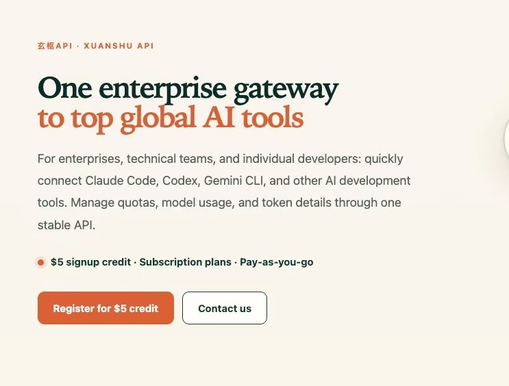

    <h1>Awesome AI Tools</h1>
    
     
    
    
    

English | [中文](README-CN.md)

This repo collects awesome AI tools. Welcome everyone to recommend more awesome AI tools together! Please use the following template as a reference for your recommendations. [issue](https://github.com/ikaijua/Awesome-AITools/issues/233)

- [Become Sponsors](#become-sponsors)

## 💎 Sponsor

  A huge thank you to our sponsors for their generous support!

<table align="center" cellpadding="10" style="width:100%; border-collapse:collapse;">
  <tr align="center">
    <td width="500" valign="middle" align="center">
      
        
          
         【<b>"Doloffer"</b>--One-stop digital subscription and top-up platform
        , We specialize in offering genuine subscriptions to various AI-powered digital services, including GPT and Claude. Get a 10% discount with code AI8888. Fast shipping and worry-free after-sales service.】
          
        
      
    </td>
  </tr>
  <tr align="center">
    <td width="500" valign="middle" align="center">
      
        
          
        【<b>Xuanshu API</b> is a next-generation AI model routing gateway for enterprises, technical teams, and individual developers. It provides one-stop API access to world-class top models (Claude, GPT, Grok, etc.) with enterprise-grade stability. Recharge and enjoy 20% off, models starting from 20% of the original price, $5 free upon registration, invoice support for enterprises. Click <a href="https://www.xuanshuapi.com/register?aff=AWESOME-AI-TOOLS&promo=AWESOME-AI-TOOLS" target="_blank">this link</a> to register and get an extra $5 credit.】
          
        
      
    </td>
  </tr>
</table>

## All Categories
- [All Categories](#all-categories)
  - [ChatGPT and other AI chatbot](#chatgpt-and-other-ai-chatbot)
  - [Open Source LLMs](#open-source-llms)
  - [LLM Leaderboard](#llm-leaderboard)
  - [AI Agent](#ai-agent)
  - [Agent Skills](#agent-skills)
  - [AI News & Information](#ai-news--information)
  - [AI Coding](#ai-coding)
  - [General LLM Applications](#general-llm-applications)
  - [Office Collaboration CLI/MCP](#office-collaboration-climcp)
  - [AI Finance & Quant Investment](#ai-finance--quant-investment)
  - [AI Image Creation and UI Design](#ai-image-creation-and-ui-design)
  - [Video Creation](#video-creation)
  - [AI Cloud Platform](#ai-cloud-platform)
  - [GPU Programming](#gpu-programming)
  - [LLM Prompts](#llm-prompts)
  - [LLM training platform](#llm-training-platform)
  - [LLM Inference & Deployment](#llm-inference--deployment)
  - [Writing](#writing)
  - [Translation](#translation)
  - [Speech Recognition](#speech-recognition)
  - [Text To Speech](#text-to-speech)
  - [Music Recognition](#music-recognition)
  - [Voice Processing](#voice-processing)
  - [AI generated music or sound effects](#ai-generated-music-or-sound-effects)
  - [Speech translation](#speech-translation)
  - [Video Content Summary](#video-content-summary)
  - [Academic research](#academic-research)
  - [OCR](#ocr)
  - [AI Detection](#ai-detection)
  - [Humanoid Robots](#humanoid-robots)
  - [Embodied AI & Simulation](#embodied-ai--simulation)

### ChatGPT and other AI chatbot
| Name | Description | Links | Fees |
| --- | --- | --- | --- |
| Claude | 🌟 Anthropic's AI assistant. Current flagship: **Claude Opus 5**. **Differentiation:** Cowork mode turns the chatbot into an agent that can pull financial data, build Excel forecasting models, and execute workflows; strongest at coding, long-context reasoning, safety, and enterprise use. | [URL](https://claude.ai/) | Free/Paid |
| ChatGPT | 🌟 OpenAI's AI assistant. Current flagship: **GPT-5.6 Sol**. **Differentiation:** persistent memory and user profile — remembers context across conversations and feels the most personalized; best general-purpose assistant for coding, writing, and daily tasks. | [URL](https://chatgpt.com) | Free/Paid |
| Gemini | Google's AI assistant. Current flagship: **Gemini 3.6 Flash**. **Differentiation:** native multimodality and Deep Research — best for image understanding/generation and web-based research; tightly integrated with Google Drive and Workspace. | [URL](https://gemini.google.com/) | Free/Paid |
| DeepSeek | DeepSeek's AI assistant. Current flagship: **DeepSeek-V4-Pro** (V4-Pro-Max reasoning mode available). **Differentiation:** reasoning-to-cost ratio — Pro-Max is the current top open-source model on coding and agentic benchmarks; same 1M context window and native multimodality at very low API cost. | [URL](https://chat.deepseek.com/) | Free/Paid |
| Kimi Chat | Moonshot AI's AI assistant. Current flagship: **Kimi K3**. **Differentiation:** 2.8T-parameter MoE + 1M-token context — optimized for software engineering, repository-scale analysis, and long-document reasoning. | 1. [Kimi](https://kimi.moonshot.cn/) 2. [Moonshot AI](https://platform.moonshot.cn/) | Free |
| GLM | Zhipu AI's AI assistant. Current flagship: **GLM-5.2**. **Differentiation:** dual thinking-effort system (High/Max) — switch between fast answers and deep reasoning; focused on agentic coding and repo-scale analysis. | 1. [URL](https://chat.z.ai/) 2. [API](https://open.bigmodel.cn/) | Free/Paid |
| Grok | xAI's AI assistant. Current flagship: **Grok 4.6**. **Differentiation:** real-time X data access — its moat is live internet/X posts as an information source; best for real-time news and events. [Intro](docs/grok/README.md) | [URL](https://grok.com/) | Free/Paid |
| Qwen | Alibaba's AI assistant. Current flagship: **Qwen3.8-Max**. **Differentiation:** open-weight 2.4T MoE + long-horizon agentic reasoning — strong coding/deep research with 1M context and native multimodality. | [URL](https://chat.qwen.ai/) | Free |
| Dola | ByteDance's AI assistant. Current flagship: **Doubao-Seed-2.1 Pro**. **Differentiation:** clean, intuitive UI with strong general capabilities — straightforward chat experience for everyday tasks. | [URL](https://www.dola.com/) | Free |

### Open Source LLMs
| Name | Description | Links | Fees |
| --- | --- | --- | --- |
| Kimi K3 | 🌟 Moonshot AI's 2.8T-parameter flagship open-weight model. Native visual understanding, 1M-token context window, and Kimi Delta Attention (KDA). The first open-source model in the 3-trillion-parameter class; full weights were released on July 27, 2026 on Hugging Face under a Modified MIT license. | [Technical Blog](https://www.kimi.com/blog/kimi-k3) [Hugging Face](https://huggingface.co/moonshotai/Kimi-K3) | Free |
| DeepSeek-V4 | 🌟 DeepSeek's 4th generation flagship model, MIT-licensed and open-weight on Hugging Face. V4-Pro (1.6T MoE, 49B activated) and V4-Flash (284B MoE, 13B activated) share a 1M-token context and native multimodality. Architecture upgrades: Hybrid Attention (CSA + HCA) cuts long-context inference FLOPs to ~27% of V3.2 and KV cache to ~10%; Manifold-Constrained Hyper-Connections (mHC) stabilizes residuals; Muon optimizer for faster convergence. Pre-trained on 32T+ tokens. Each model ships with three reasoning effort modes — **Non-think** (fast), **Think High**, and **Think Max** — where **Pro-Max** is currently the strongest open-source model on coding and agentic benchmarks. |[Hugging Face](https://huggingface.co/collections/deepseek-ai/deepseek-v4)|Free|
| DeepSeek-R1 |DeepSeek's first-generation reasoning models, DeepSeek-R1-Zero and DeepSeek-R1. DeepSeek-R1-Zero, a model trained via large-scale reinforcement learning (RL) without supervised fine-tuning (SFT) as a preliminary step, demonstrated remarkable performance on reasoning.|[Github](https://github.com/deepseek-ai/DeepSeek-R1) |Free|
| DeepSeek-V3 |A strong Mixture-of-Experts (MoE) language model with 671B total parameters with 37B activated for each token.|[Github](https://github.com/deepseek-ai/DeepSeek-V3) |Free|
| Qwen3 |Qwen3 is the large language model series developed by the Qwen team at Alibaba Cloud. Qwen3-2507 includes Instruct and Thinking variants with 235B-A22B, 30B-A3B, and 4B sizes, 256K long context, and 1M-token input support in some scenarios.|[Github](https://github.com/QwenLM/Qwen3) |Free|
| Gemma 4 |Gemma 4 is Google's latest open source large language model series, built on the Gemini architecture, offering improved performance, longer context windows, and better multilingual support.|[Github](https://github.com/google/gemma.cpp) |Free|
| Muse Glimmer | Meta's 30B-parameter open-weight multimodal model for local agents, released under Apache 2.0. Features ~131K context, text/image input, tool use, 4-bit quantized variants for 24–32 GB VRAM, and DFlash speculative decoding. Distilled from Muse Spark. [Intro](docs/muse-glimmer/README.md) | [Hugging Face](https://huggingface.co/meta-models/Muse-Glimmer-30B) | Free |
| Llama 3 | Llama3 is a large language model developed by Meta AI. It is the successor to Meta's Llama2 language model.  Online test address: [huggingface.co/Meta-Llama-3-70B-Instruct](https://huggingface.co/chat/models/meta-llama/Meta-Llama-3-70B-Instruct) |[GitHub](https://github.com/meta-llama/llama3) | Free |
| Mixtral |Mixtral 8x7B, a high-quality sparse mixture of experts model (SMoE) with open weights. Mixtral outperforms Llama 2 70B on most benchmarks with 6x faster inference. It matches or outperforms GPT3.5 on most standard benchmarks.  paper：https://arxiv.org/pdf/2401.04088.pdf  news：https://mistral.ai/news/mixtral-of-experts/ |[mistral-inference](https://github.com/mistralai/mistral-inference)  [mistral-finetune](https://github.com/mistralai/mistral-finetune) |Free|
|grok-1|A large language model open sourced by xAI|[Github](https://github.com/xai-org/grok-1) |Free|
|Phi-3| Phi-3, a family of open AI models developed by Microsoft. Phi-3 models are the most capable and cost-effective small language models (SLMs) available, outperforming models of the same size and next size up across a variety of language, reasoning, coding, and math benchmarks.|[Github](https://github.com/microsoft/Phi-3CookBook) |Free|

### LLM Leaderboard
| Name | Description | Links | Fees |
| --- | --- | --- | --- |
|LMSYS Chatbot Arena Leaderboard|LMSYS Chatbot Arena is a crowdsourced open platform for LLM evals. Collected over 1,000,000 human pairwise comparisons to rank LLMs with the Bradley-Terry model and display the model ratings in Elo-scale. |[URL](https://lmarena.ai/leaderboard) |Free|
|Artificial Analysis|Artificial Analysis is a platform that provides AI model and service provider comparisons and benchmarks to help users make informed decisions when choosing AI models and service providers. The platform provides comparative data on a wide range of popular AI models, including OpenAI's GPT-4, Meta's Llama 3, and Anthropic's Claude series, covering performance metrics such as response time, latency, and cost.|[URL](https://artificialanalysis.ai/)|Free|
|LiveCodeBench|LiveCodeBench is a holistic and contamination-free evaluation benchmark of LLMs for code that continuously collects new problems over time. Particularly, LiveCodeBench also focuses on broader code-related capabilities, such as self-repair, code execution, and test output prediction, beyond mere code generation. |[URL](https://livecodebench.github.io/leaderboard.html)|Free|
|StructEval|StructEval is a TMLR 2025 benchmark and public leaderboard for evaluating LLM structured-output generation and conversion across 2,035 examples, 18 text and renderable formats, and format-specific structural and visual checks.|[Leaderboard](https://tiger-ai-lab.github.io/StructEval/) [Paper](https://openreview.net/forum?id=buDwV7LUA7) [Github](https://github.com/TIGER-AI-Lab/StructEval)|Free|
|LLM Stats|LLM Stats, the most comprehensive LLM leaderboard, benchmarks and compares API models using daily‑updated, open‑source community data on capability, price, speed, and context length.|[URL](https://llm-stats.com/)|Free|
|ModelCap|ModelCap publishes live AI model rankings (the ModelCap Index) compiled only from named public sources — benchmark boards such as SWE-bench, ARC-AGI and BFCL, Arena ratings and provider prices — with an evidence tier and score interval per model, per-benchmark leaderboards, head-to-head model comparisons, provider pricing pages and a CC BY 4.0 JSON/CSV dataset.|[URL](https://modelcap.ai/)|Free|
|Price Per Token|Compare LLM API pricing across 200+ models from OpenAI, Anthropic, Google, and more. Includes token counters, cost calculators, and benchmark comparisons.|[URL](https://pricepertoken.com/)|Free|
|BenchGecko|The data layer of the AI economy. AI model benchmark leaderboard with cross-provider pricing comparison across hundreds of providers. Tracks thousands of models across 128 benchmarks, AI economy indicators, agent leaderboard, and MCP server directory. Free API.|[URL](https://benchgecko.ai/)|Free|

### AI Agent
| Name | Description | Links | Fees |
| --- | --- | --- | --- |
| Claude Code | 🌟 Anthropic's AI coding agent. Available in the terminal CLI, VS Code/Cursor/JetBrains IDE plugins, desktop app, and web. Built on the Claude model family, it offers long-context codebase understanding, multi-file editing, shell command execution, MCP extensions, skills/hooks/subagents, CLAUDE.md project rules, and automatic memory. Supports Remote Control to continue local sessions from your phone or browser. [Intro](docs/claude-code/README.md) [Comparison](docs/COMPARISON.md) |[Github](https://github.com/anthropics/claude-code)  |Free|
| Codex | 🌟 OpenAI's open-source (Apache-2.0) terminal coding agent, written in Rust. Supports the terminal CLI, VS Code/Cursor/Windsurf IDE extensions, Codex App/desktop app, and Codex Web cloud tasks. It can understand and modify code directly, with kernel-level sandboxing, MCP, skills/plugins/hooks, subagents, and Remote SSH. Active sessions sync across phone/desktop/web via the ChatGPT relay. [Intro](docs/codex/README.md) [Comparison](docs/COMPARISON.md) |[Github](https://github.com/openai/codex) |Free|
| Kimi Code | 🌟 Moonshot AI's AI coding agent CLI that runs in your terminal. Reads and edits code, runs shell commands, searches files, fetches web pages, and plans next steps based on feedback. Supports video input, AI-native MCP configuration, subagents, lifecycle hooks, and ACP editor integration (Zed, JetBrains). [Intro](docs/kimi-code/README.md) [Comparison](docs/COMPARISON.md) | [Github](https://github.com/MoonshotAI/kimi-code)  | Free |
| DeepSeek Harness | 🌱 DeepSeek's open-source (MIT) agent harness released on August 13, 2026. A full agent runtime (CLI + Web UI at 127.0.0.1:3080) with an "everything is a plugin" architecture powered by Cordis. Ships 40+ first-party packages (LLM, MCP, LSP, ACP, sandbox, skills, subagents, sessions, tools, plans, scheduling, web, shell, etc.) and bilingual EN/ZH architecture docs. Currently developer preview — breaking changes expected. [Intro](docs/deepseek-harness/README.md) | [Github](https://github.com/deepseek-ai/deepseek-harness)  | Free |
|Antigravity|Google's agent-first AI coding platform, Antigravity 2.0, delivered as a standalone desktop app, IDE, terminal CLI (`agy`), and SDK, replacing Gemini CLI. Built around Gemini 3.5/3.6 Flash and supporting Claude, GPT-OSS, and other models via model picker. Features Editor and Manager views for orchestrating multiple autonomous agents, integrated browser/terminal, verifiable Artifacts (plans, screenshots, recordings), subagents, hooks, and scheduled tasks. [Intro](docs/antigravity/README.md)|[URL](https://antigravity.google/)|Free during preview|
| Pi | Open-source (MIT) self-extensible coding agent by earendil-works. Monorepo architecture with `pi-coding-agent` (interactive CLI), `pi-agent-core` (tool calling and state management), `pi-ai` (unified multi-provider LLM API), `pi-tui`, and telemetry. Features plugin architecture, supply-chain hardening (pinned deps, shrinkwrap, audit), and sandboxing patterns (Gondolin, Docker, OpenShell). [Intro](docs/pi/README.md) | [Github](https://github.com/earendil-works/pi)  | Free |
| Grok build | xAI's terminal-based AI coding agent, open-sourced and written in Rust. Runs as a full-screen, mouse-interactive TUI that understands your codebase, edits files, runs shell commands, searches the web, and manages long-running tasks. Supports interactive, headless (scripting/CI), and ACP editor-embedded modes, with MCP servers, skills, plugins, hooks, and sandboxing. [Intro](docs/grok-build/README.md) | [Github](https://github.com/xai-org/grok-build)  | Free |
|OpenClaw|Open-source self-hosted AI agent that runs locally and autonomously executes tasks. Connects to WhatsApp, Telegram, Slack, Discord and other messaging platforms, with browser control, system access, and persistent memory. Developed by Peter Steinberger, one of the fastest-growing open-source projects. [Intro](docs/openclaw/README.md)|[Github](https://github.com/openclaw/openclaw) |Free|
|OpenWorker|Open-source, local-first desktop AI coworker by Andrew Ng. Delivers finished work (documents, Slack replies, calendar updates, reports) rather than chat answers. Supports 35+ app connectors, MCP, and bring-your-own-key models (OpenAI, Anthropic, Gemini, DeepSeek, Kimi, Qwen, Ollama, etc.) with local storage of data and credentials. [Intro](docs/openworker/README.md)|[Github](https://github.com/andrewyng/openworker) |Free|
| autoresearch | An autonomous AI agent for machine learning research by Karpathy. It can formulate hypotheses, modify training code, run experiments, and evaluate results autonomously to find performance improvements. | [Github](https://github.com/karpathy/autoresearch)  | Free |
| ml-intern | An open-source, autonomous AI agent by Hugging Face designed to function as a specialized Machine Learning Engineer. It handles the end-to-end ML lifecycle, including researching papers, writing code, running experiments, and shipping models to the Hugging Face Hub. [Intro](docs/ml-intern/README.md) | [Github](https://github.com/huggingface/ml-intern)  | Free |
| Dexter | Autonomous financial research agent designed to perform deep analysis by thinking, planning, and learning through iteration. Specialized for the financial domain. [Intro](docs/dexter/README.md) | [Github](https://github.com/virattt/dexter)  | Free |
| Multica | Open-source managed agents platform to integrate AI coding agents (Claude Code, Codex, Cursor, Copilot, OpenCode, OpenClaw, Hermes, Gemini, Pi, Kimi, Kiro CLI, and more) into dev teams as first-class teammates. Features task assignment, progress tracking, reusable skills, and local daemon auto-detection of installed agent CLIs. [Intro](docs/multica/README.md) | [Github](https://github.com/multica-ai/multica)  | Free/Paid |
| Paperclip | Open-source AI agent orchestration platform that models AI operations as a company. Define org charts, reporting lines, budgets, and governance policies, then let agents work autonomously within that structure. Supports OpenClaw, Claude Code, Codex, and other agent backends. Heartbeat-based execution with cost controls and audit trails. [Intro](docs/paperclip/README.md) | [Github](https://github.com/paperclipai/paperclip)  | Free |
| Symphony | OpenAI's open-source project-to-delivery harness. Turns project requirements into isolated, autonomous implementation runs; agents monitor boards like Linear, open PRs, and merge code with proof-of-work (CI status, review feedback, demo videos). Currently in engineering preview. [Intro](docs/symphony/README.md) | [Github](https://github.com/openai/symphony)  | Free |
| QM | YC open-source multi-agent harness for organizations. Runs on Slack and Web with scoped workspaces (memory, files, credentials, permissions) per employee/project/channel; headless core with replaceable models/harnesses and self-hostable via Docker/Fly/AWS. [Intro](docs/qm/README.md) | [Github](https://github.com/yc-software/qm)  | Free |
| Buzz | Open-source, self-hostable workspace where humans and AI agents share the same rooms. Agents get their own keys and audit trail to open repos, send patches, review code, run workflows, edit canvases, and join voice huddles. Built on a Nostr relay so every message and action is a signed event. [Intro](docs/buzz/README.md) | [Github](https://github.com/block/buzz)  | Free |
|deer-flow|ByteDance's open-source long-horizon SuperAgent harness. Orchestrates sub-agents, memory, sandboxes, tools, skills, and message gateways to research, code, and create. Built on LangGraph/LangChain with a web UI and multi-provider LLM support. [Intro](docs/deer-flow/README.md)|[Github](https://github.com/bytedance/deer-flow) |Free|
| Orkas | Open-source, local-first multi-agent AI desktop client. A Commander decomposes goals and coordinates specialist agents in parallel or sequence, with private skills and memory. Supports BYO model providers and local model endpoints, and can drive Claude Code, Codex, OpenClaw, OpenCode, and Hermes. Cross-platform (macOS / Windows / Linux). | [Website](https://orkas.ai?source=github_awesome_aitools) [Github](https://github.com/Orkas-AI/Orkas)  | Free |
| AgentsMesh | The AI Agent Workforce Platform. Self-hostable remote AI workstations (AgentPods) with PTY sandbox + git worktree isolation, multi-agent collaboration via channels and pod bindings, built-in Kanban with MR/PR integration, per-pod MCP server. Supports Claude Code, Codex CLI, Gemini CLI, Aider, OpenCode. | [Github](https://github.com/AgentsMesh/AgentsMesh)  | Free (BSL-1.1) |
|microsoft/autogen|AutoGen is an open-source programming framework for building AI agents and facilitating cooperation among multiple agents to solve tasks. |[Github](https://github.com/microsoft/autogen) |Free|
|msitarzewski/agency-agents|Open-source AI agency toolkit with 230+ specialized agent personas across engineering, design, marketing, sales, finance, game dev, healthcare, and more. Features ready-to-use agent personalities, workflow templates, deliverables, and a native desktop app to browse/install agents into Claude Code, Cursor, Codex, Gemini, Kimi Code, Aider, and other AI dev tools. [Intro](docs/agency-agents/README.md)|[Github](https://github.com/msitarzewski/agency-agents) |Free|
| ECC | Open-source enhancement framework for AI coding agents. Unified agent/skills/rules/Hooks/MCP configuration across Claude Code, Codex, Cursor, OpenCode, Gemini, Zed, GitHub Copilot. Ships with 60 sub-agents, 232 skills, persistent memory, AgentShield security scan, and desktop dashboard GUI. | [Github](https://github.com/affaan-m/ECC)  | Free |
| CC Switch | Cross-platform desktop app to manage Claude Code, Codex, Gemini CLI, OpenCode, and OpenClaw. Features visual configuration for API providers, MCP servers, and skills with bidirectional sync. [Intro](docs/cc-switch/README.md) | [Github](https://github.com/farion1231/cc-switch)  | Free |
| codex-plugin-cc | Claude Code plugin that enables using OpenAI Codex for code reviews and task delegation directly within Claude Code workflow. Provides /codex:review, /codex:adversarial-review and other commands | [Github](https://github.com/openai/codex-plugin-cc)  | Free |
| codesight | CLI token optimizer and AI context generator with built-in MCP server. Scans codebases to extract routes, schema, components, and dependencies, reducing AI context tokens by 9x–13x. Profiles for Claude Code, Cursor, Copilot, Codex, and Windsurf. Zero runtime dependencies. | [Github](https://github.com/Houseofmvps/codesight)  | Free |
| AGENTS.md | An open standard for codebase documentation designed specifically for AI coding agents. Provides structured context, instructions, and constraints to help agents work more effectively and safely. [Intro](docs/agents/README.md) | [Github](https://github.com/agentsmd/agents.md)  | Free |
| Spec Kit | GitHub's open-source toolkit for Spec-Driven Development (SDD). Provides the `specify` CLI and slash commands (/speckit.specify, /speckit.plan, /speckit.implement, etc.) that integrate with 30+ AI coding agents to turn specifications into executable implementation plans. | [Github](https://github.com/github/spec-kit)  | Free |
| musistudio/claude-code-router | A powerful tool to route Claude Code requests to different models and customize any request. Supports multi-provider routing, request/response transformation, dynamic model switching, CLI model management, and GitHub Actions integration. |[Github](https://github.com/musistudio/claude-code-router) |Free|
|instructkr/claw-code|A reimplementation of Anthropic's Claude Code agent harness, currently being rewritten in Rust for memory safety. Focuses on building a better tool harness for AI agents with legal/ethical reimplementation |[Github](https://github.com/instructkr/claw-code) |Free|
|MemPalace|Open-source AI memory system that stores full conversations and project data locally without cloud dependencies. Organizes memories into a hierarchical "palace" structure, achieves 96.6% recall on LongMemEval benchmarks (highest scoring), supports MCP integration and works offline with local LLMs.|[Github](https://github.com/milla-jovovich/mempalace) |Free|
| TencentDB Agent Memory | Tencent Cloud's open-source memory infrastructure for agent teams. Provides Memory Hub for cross-session/cross-agent memory sharing, Chat Memory with L0–L3 distillation, Skill library for reusable expertise, and Wiki/CodeGraph for docs/code knowledge maps. Works with Claude Code, CodeBuddy, and other agents. [Intro](docs/tencentdb-agent-memory/README.md) | [Github](https://github.com/TencentCloud/TencentDB-Agent-Memory)  | Free |
| Cua | Open-source infrastructure for Computer-Use Agents (CUA). Provides sandboxes, drivers, and SDKs for macOS, Windows, Linux, and Android, enabling AI to control full desktops just like a human. [Intro](docs/cua/README.md) | [Github](https://github.com/trycua/cua)  | Free |
| Hermes Agent | Open-source agentic framework built by NousResearch, fine-tuned on Hermes models with strong tool calling and reasoning capabilities for building autonomous AI agents. | [Github](https://github.com/NousResearch/hermes-agent)  | Free |
| Screenpipe | Open-source 24/7 local screen + microphone recorder with OCR, audio transcription, and semantic search. Provides AI agents with long-term context of everything you've seen, said, or heard via MCP. Fully offline with Ollama or any local LLM. Cross-platform (macOS / Windows / Linux). | [Github](https://github.com/screenpipe/screenpipe)  | Free |
|MastraAI|Mastra is an opinionated TypeScript framework that helps you build AI applications and features quickly. It gives you the set of primitives you need: workflows, agents, RAG, integrations and evals|[Github](https://github.com/mastra-ai/mastra) |Free|
| FlowGram.AI | An extensible visual AI workflow development framework with built-in canvas, form engine, variable scope chain, and ready-to-use materials (LLM, Condition, Code Editor, etc.) for building AI workflow platforms faster. | [Github](https://github.com/bytedance/flowgram.ai)  | Free |
| Conductor | Netflix-originated open-source durable workflow engine now focused on AI agent orchestration. Provides event-driven execution, durable state, retries/timeouts, 14+ LLM providers, MCP tool calling, function calling, human-in-the-loop approval, and vector DB integration for RAG. Trusted in production at Netflix, Tesla, LinkedIn, and J.P. Morgan. [Intro](docs/conductor/README.md) | [Github](https://github.com/conductor-oss/conductor)  | Free |
| DeepTutor | An agent-native learning workspace by HKUDS that unifies AI tutoring, problem solving, quiz generation, research, visualization, and mastery practice. Features multi-engine RAG, persistent memory, Partners/My Agents, and live coding CLI integration. [Intro](docs/deeptutor/README.md) | [Github](https://github.com/HKUDS/DeepTutor)  | Free |
|potpie-ai/potpie|Open Source AI Agents for your codebase in minutes. Use pre-built agents for Q&A, Testing, Debugging and System Design or create your own purpose-built agents. |[URL](https://potpie.ai) , [Github](https://github.com/potpie-ai/potpie) |Free Trial|
|agentscope|Agent-Oriented Programming for Building LLM Applications, Open-sourced by Alibaba|[Github](https://github.com/agentscope-ai/agentscope)|Free|
|Auto-GPT|Open source, An experimental open-source attempt to make GPT-4 fully autonomous.|[GitHub](https://github.com/Significant-Gravitas/Auto-GPT)   |Free|
|CLI-Anything|An open-source framework that makes all software agent-native — auto-generates production-ready CLIs for any application via a 7-phase pipeline, enabling AI agents to control any desktop software. Supports 16+ AI agent platforms including Claude Code, OpenClaw, Codex and includes CLI-Hub for community CLI discovery. |[Github](https://github.com/HKUDS/CLI-Anything) |Free|
|AnyGen|AnyGen is the AI assistant that truly "gets work done" for you. From writing and analysis to planning and reporting, it transforms your ideas into ready-to-use professional deliverables in minutes. [The AI Assistant Built for Work](https://www.anygen.io/task/LkA2pg7EXaVJkrgETSol5DelgEd)|[URL](https://www.anygen.io/)|Free Trial/Paid|
| Understand Anything | AI-powered codebase and knowledge base analysis tool that builds interactive visual knowledge graphs. Features multi-agent analysis, architecture guided tours, and semantic search for large codebases. Works as a plugin for Claude Code, Cursor, and more. [Intro](docs/understand-anything/README.md) | [Github](https://github.com/Lum1104/Understand-Anything)  | Free |
### Agent Skills
| Name | Description | Links | Fees |
| --- | --- | --- | --- |
| anthropics/skills | Official skills repository for Claude Code skills, providing reusable tool integrations and extensions for Claude Code AI assistant | [Github](https://github.com/anthropics/skills)  | Free |
| openai/skills | Official skills repository for OpenAI GPT models, providing reusable tools and extensions for OpenAI's AI assistants | [Github](https://github.com/openai/skills)  | Free |
| skills.sh | Community-driven skills registry and marketplace for AI assistants, providing a curated collection of reusable skills for various AI platforms including Claude Code, OpenAI GPT, and other LLM assistants, with download usage statistics and trending popularity rankings for all skills | [Website](https://skills.sh/) | Free/Paid |
| BrowserAct Skills | Directory of reusable AI-agent skills and browser automation workflows for research, ecommerce, social/search extraction, video platforms, maps, and operational automation. | [Website](https://skills.browseract.com/) | Free |
| JimLiu/baoyu-skills | Community skills repository for Claude Code, providing practical Chinese-language and region-specific skills including Weibo posting functionality | [Github](https://github.com/JimLiu/baoyu-skills)  | Free |
| ClawHub | A fast skill registry for AI agents, with vector search capabilities. Provides a centralized platform for managing and discovering agent skills. | [URL](https://clawhub.ai/) | Free/Paid |
| garrytan/gstack | An opinionated collection of Claude Code skills that transform the AI agent into a specialized team of experts (CEO, PM, QA, DevOps). Adds custom slash commands and automated quality checks. | [Github](https://github.com/garrytan/gstack)  | Free |
| addyosmani/agent-skills | A curated library of 20+ engineering workflow skills for AI coding assistants. Standardizes the software development lifecycle from requirements through shipping, with 7 built-in commands: /spec, /plan, /build, /test, /ship, etc. Built by Google Gemini team lead Addy Osmani. Compatible with Claude Code, Gemini CLI, Codex, and Cursor. | [Github](https://github.com/addyosmani/agent-skills)  | Free |
| phuryn/pm-skills | Product-management skills marketplace for Claude Code and Claude Cowork, providing PM skills and chained workflows across discovery, strategy, execution, launch, growth, and shipping AI-built code. | [Github](https://github.com/phuryn/pm-skills)  | Free |
| NVIDIA/SkillSpector | Open-source security scanner for AI agent skills from NVIDIA. Scans skills (from Git repos, URLs, zip files, or directories) for risky patterns including prompt injection, data exfiltration, privilege escalation, malicious code, supply-chain issues, and MCP tool poisoning. Uses static analysis plus optional LLM-based semantic review and can be used in CI/CD or as an MCP server. | [Github](https://github.com/NVIDIA/SkillSpector)  | Free |
| Superpowers | A complete software development methodology for coding agents, built on composable skills. Enforces spec-driven design, TDD, systematic debugging, code review, and subagent-driven development across Claude Code, Codex, Cursor, Kimi Code, OpenCode, Antigravity, GitHub Copilot CLI, and Pi. [Intro](docs/superpowers/README.md) | [Github](https://github.com/obra/superpowers)  | Free |
| last30days-skill | AI agent skill that researches any topic across Reddit, X, YouTube, Hacker News, Polymarket, GitHub, arXiv, and the web, then synthesizes a grounded summary scored by real engagement. Supports Claude Code, Codex, Cursor, Gemini CLI, and 50+ Agent Skills hosts. | [Github](https://github.com/mvanhorn/last30days-skill)  | Free |
| Claude Video | Claude Code skill that lets AI agents "watch" videos: extracts frames, pulls transcripts/captions, and answers questions grounded in what is seen and heard. Supports YouTube, TikTok, local files, and 50+ agent hosts via the Agent Skills CLI. | [Github](https://github.com/bradautomates/claude-video)  | Free |

### AI News & Information
| Name | Description | Links | Fees |
| --- | --- | --- | --- |
| SemiAnalysis | In-depth research and analysis on semiconductors, AI hardware, GPUs, data centers, and the compute supply chain, founded by Dylan Patel. Publishes long-form industry reports with deep coverage of the AI industry (some free, most subscription). | [X](https://x.com/SemiAnalysis_), [Official Site](https://semianalysis.com) | Free/Paid |
| World Monitor | AI-powered real-time global intelligence dashboard with 435+ curated feeds, geopolitical monitoring, infrastructure tracking, AI summaries, 21 languages support, local AI runtime and cross-platform native desktop apps | [Github](https://github.com/koala73/worldmonitor) , [Official Site](https://worldmonitor.app) | Free |
| Prismix | AI hub aggregating real-time status of 75+ AI services (OpenAI, Anthropic, Groq, Cursor, etc.), curated news from 55+ AI sources with a personalized feed, and 500+ MCP server directory with bundles. Email/webhook alerts on outages. | [Official Site](https://prismix.dev) | Free/Paid |
| AI Weekly | Independent AI news newsletter, 3x/week since 2015, read by 44,000+ professionals. The few AI stories that matter, solo-edited. Proprietary AI Weekly Index, quarterly State-of-AI recap, Who's-Who-of-AI graph (2,335 figures), and an 11-year archive. | [Official Site](https://aiweekly.co) | Free |

### AI Coding
| Name | Description | Links | Fees |
| --- | --- | --- | --- |
| Cursor | 🌟 A collaborative code editor using GPT | [URL](https://www.cursor.so) | Paid/Free Trial |
| GitHub Copilot | A code writing assistant developed by GitHub and OpenAI | [URL](https://github.com/features/copilot) | Paid|
| OpenCode | Open-source terminal-native AI coding agent. Provider-agnostic (Anthropic, OpenAI, Google, local models), with a TUI client/server architecture, LSP integration, and support for custom agents and MCP servers. [Intro](docs/opencode/README.md) | [URL](https://opencode.ai) [Github](https://github.com/anomalyco/opencode)  | Free |
| OpenChamber | Desktop and web GUI for the OpenCode AI agent. Provides session management, diffs, and workspace control on top of OpenCode. [Intro](docs/openchamber/README.md) | [URL](https://openchamber.dev) [Github](https://github.com/openchamber/openchamber)  | Free |
| oh-my-pi | Fork of Pi by @can1357. A terminal-native AI coding agent with the IDE wired in: LSP, DAP debugging, Python/Bun code execution, 40+ providers, and 32 built-in tools. [Intro](docs/oh-my-pi/README.md) | [Github](https://github.com/can1357/oh-my-pi)  | Free |
| dbForge AI Assistant | AI-powered tool that generates, optimizes, and troubleshoots SQL code; indispensable for developers, DBAs, and analysts | [URL](https://www.devart.com/dbforge/ai-assistant/) | Paid/Free Trial|
| Happy Coder | Mobile and Web client for Codex and Claude Code, with realtime voice, encryption and fully featured | [URL](https://happy.engineering) [GitHub](https://github.com/slopus/happy)  | Free |
| Trae | ByteDance's AI coding IDE. Trae is your helpful coding partner. It offers features like AI Q&A, code auto-completion, and agent-based AI programming capabilities. | [URL](https://www.trae.ai/) | Free|
| scalene |Scalene: a high-performance, high-precision CPU, GPU, and memory profiler for Python with AI-powered optimization proposals|[Github](https://github.com/plasma-umass/scalene)  |Free|
| git-lrc | Free, Unlimited AI Code Reviews That Run on Every Commit | [GitHub](https://github.com/HexmosTech/git-lrc)  | Free|
| alibaba/open-code-review | Open-source AI code-review CLI/agent by Alibaba. Reviews Git diffs with deterministic pipelines plus an LLM agent, supports line-level comments, configurable OpenAI/Anthropic-compatible endpoints, custom rules, JSON CI output, WebUI session viewer, and Claude Code/Codex integrations. | [Github](https://github.com/alibaba/open-code-review)  | Free |
| Kodus | Open Source Code Review Agent | [GitHub](https://github.com/kodustech/kodus-ai/)  | Free/Paid|
| Steel Browser | Open-source browser sandbox and automation infrastructure for AI agents and apps with session-backed workflows, screenshots, PDFs, proxies, and anti-bot tooling. | [Github](https://github.com/steel-dev/steel-browser)  | Free |
| Termux | Android terminal emulator and Linux environment app that allows you to run coding tools, AI models and development environments directly on your mobile device, with built-in SSH client support for logging into remote hosts. | [Github](https://github.com/termux/termux-app)  | Free |
| AI-Codereview-Gitlab | GitLab automatic code review tool based on LLMs (DeepSeek, OpenAI, etc.). Supports DingTalk/WeCom/Feishu notifications and daily reports generation. Docker deployment supported with visual Dashboard. | [Github](https://github.com/sunmh207/AI-Codereview-Gitlab)  | Free |
| code-review-graph | Builds a structural code graph with Tree-sitter, tracks incremental changes, and exposes precise review context to AI coding assistants via MCP to reduce redundant codebase reads. | [Github](https://github.com/tirth8205/code-review-graph)  | Free |
| Cate | Open source desktop IDE on an infinite zoomable canvas. You arrange Monaco editors, xterm.js terminals, embedded browsers, and Claude Code agent panels in freeform zoomable space instead of tabs. Panels can float, dock, or detach into separate windows, and layout persists per project. Built with Electron, runs on macOS, Windows, and Linux. | [URL](https://cate.cero-ai.com) [Github](https://github.com/0-AI-UG/cate)  | Free |
| CLIProxyAPI | A proxy server that exposes AI CLI tools and subscriptions (Claude Code, Codex, Gemini, Grok, etc.) through OpenAI/Gemini/Claude/Codex-compatible API interfaces. Supports OAuth login, streaming/WebSocket responses, function calling, multimodal input, and multi-account load balancing across providers. | [Github](https://github.com/router-for-me/CLIProxyAPI)  | Free |
| Markstream | Open-source streaming Markdown renderer family for AI chat interfaces. Handles incomplete Markdown and smooth token pacing, with maintained Vue 3/Nuxt, React/Next.js, Svelte, Angular, Vue 2, and framework-agnostic parser/core packages. Supports Mermaid, KaTeX, code highlighting, safe HTML, and SSR. | [Frameworks](https://markstream.simonhe.me/frameworks) [Vue Playground](https://markstream-vue.simonhe.me/) [Github](https://github.com/Simon-He95/markstream-vue)  | Free |
| Codex Security | Open-source CLI and TypeScript SDK from OpenAI for finding, validating, and fixing security vulnerabilities in code. Supports repository scanning, finding tracking, fix verification, CI/CD integration, and containerized bulk scans. [Intro](docs/codex-security/README.md) | [Github](https://github.com/openai/codex-security)  | Free |

### General LLM Applications
| Name | Description | Links | Fees |
| --- | --- | --- | --- |
| Google AI Studio|Google AI Studio is a free, web-based developer tool that enables you to quickly develop prompts using the latest Gemini 3.6 Flash models and then get an API key to use in your app development. [Available regions](https://ai.google.dev/gemini-api/docs/available-regions#available_regions)|[URL](https://aistudio.google.com/)|Free|
| Gemini Notebook (formerly NotebookLM) |Google's AI research assistant, formerly NotebookLM. Upload PDFs, websites, YouTube videos, audio files, Google Docs, or Google Slides, and Gemini Notebook will summarize them and make interesting connections between topics. Audio Overview feature can turn your sources into engaging “Deep Dive” discussions with one click. |[URL](https://notebook.google.com/)|Free|
| Poe | Quora's multi-model AI chat platform. Access GPT, Claude, Gemini, Grok, Kimi, DeepSeek, and many other chat/image/video models through a single interface with a points-based subscription. Supports custom bots, group chats, side-by-side model comparison, and an OpenAI-compatible API. | [URL](https://poe.com/) | Free/Paid |
|Cherry Studio|Cherry Studio is a desktop client that supports for multiple LLM providers, available on Windows, Mac and Linux. Support major LLM Cloud Services: OpenAI, Gemini, Anthropic, and more AI Web Service Integration: Claude, Peplexity, Poe, and others Local Model Support with Ollama, LM Studio|[Github](https://github.com/CherryHQ/cherry-studio) |Free|
| HuggingChat|Open source codebase powering the HuggingChat app. [URL](https://huggingface.co/chat/)|[Github](https://github.com/huggingface/chat-ui) |Free|
| Learn about |AI learning Assistant developed by Google.Grasp new topics and deepen your understanding with a conversational learning companion that adapts to your unique curiosity and learning goals.|[URL](https://learning.google.com/experiments/learn-about)|Free|
| ollama |Get up and running with Llama 2, Mistral, Gemma, and other large language models.|[Github](https://github.com/ollama/ollama) | Free |
|langchain|LangChain is a framework for developing applications powered by language models.|[Github](https://github.com/langchain-ai/langchain) |Free|
|Helicone AI|Helicone is the open-source LLM observability platform for logging, monitoring, and debugging AI applications.|[Github](https://github.com/Helicone/helicone) |Free|
|WFGY ProblemMap|Open-source RAG failure-mode checklist and diagnostics toolkit for LLM pipelines (data, embeddings, retrievers, tools, evaluation). MIT-licensed and used by several labs and infra projects as a practical RAG debugging guide.|[Github](https://github.com/onestardao/WFGY/blob/main/ProblemMap/README.md) |Free|
| screenshot-to-code | Converts screenshots, mockups, Figma designs, and screen recordings into clean, functional code. Supports multiple AI models (Gemini 3 Flash, GPT-5.5, Claude Opus 4.8) and output stacks (HTML+Tailwind, React, Vue, Bootstrap, etc.). Also supports URL cloning and video-to-code conversion. | [GitHub](https://github.com/abi/screenshot-to-code) | Free, requires API keys (OpenAI/Anthropic/Gemini recommended)|
|together.ai chat|Similar to HuggingChat, with the option of different open source models, support for DeepSeek R1, LLaMA, QWen, Flux Schnell. 60 free messages per day.|[URL](https://chat.together.ai/)|Free/Paid|
| NadirClaw | Open-source LLM router that classifies prompts in ~10ms and routes to the optimal model tier (free/cheap/premium/reasoning). OpenAI-compatible proxy with agentic detection, session pinning, and 429 fallback. | [GitHub](https://github.com/doramirdor/NadirClaw)  | Free |
| Harbor | Effortlessly run LLM backends, APIs, frontends, and services with one command. | [GitHub](https://github.com/av/harbor)   |  Free |
|NoteGPT|NoteGPT is a smart note-taking tool that can record, transcribe, and summarize various content, such as meetings, lectures, podcasts, YouTube videos, news briefings, and articles.| [URL](https://notegpt.io/) | Free/Paid |
|OpenRouter| A unified API gateway for 400+ AI models (OpenAI, Anthropic, Google, Mistral, etc.). Zero markup pricing, 5% commission on inference traffic, supports smart routing/failover |[URL](https://openrouter.ai/)| Free/Paid |
| OmniRoute | Self-hostable AI gateway with 4-tier automatic fallback routing across 36+ providers. OpenAI-compatible API with quota tracking and zero-cost fallback to free tiers. | [GitHub](https://github.com/diegosouzapw/OmniRoute)    | Free |
| Morphik.ai | Open source AI-driven search engine for private documents | [URL](https://morphik.ai) [Github](https://github.com/morphik-org/morphik-core) | Free |
| Future AGI | Open-source platform to simulate, evaluate, trace, guardrail, route, and optimize LLM and AI agent apps in one feedback loop, so agents don't just get monitored, they self-improve. Self-hostable. Apache-2.0. | [Github](https://github.com/future-agi/future-agi)  | Free |
| Recast | Browser tool that turns messy LLM output into valid JSON and lists every change. Runs entirely client-side; nothing is uploaded. | [URL](https://recast-indol.vercel.app/) | Free/Paid |

### Office Collaboration CLI/MCP
| Name | Description | Links | Fees |
| --- | --- | --- | --- |
| Chrome DevTools MCP | Official Model Context Protocol server from Chrome DevTools that enables AI coding agents (like Claude Code, Gemini CLI) to control and inspect a live Chrome browser. Supports performance trace analysis, network request debugging, screenshot capture, and console log inspection, helping AI agents better run, test, and debug code. | [Github](https://github.com/ChromeDevTools/chrome-devtools-mcp)  | Free |
| Lightpanda | A lightweight, high-performance headless browser written in Zig, designed for AI agents. Optimized for speed and low memory (~9x faster than Chrome), featuring native MCP support and Markdown output for LLMs. [Intro](docs/lightpanda/README.md) | [Github](https://github.com/lightpanda-io/browser)  | Free |
| bb-browser | Enable AI agents to control your real Chrome browser session, accessing sites with your existing login state without APIs. | [Github](https://github.com/epiral/bb-browser)  | Free |
| Google Workspace CLI | Community-built unofficial command-line tool for Google Workspace that provides unified access to all Google Workspace APIs including Drive, Gmail, Calendar, Sheets, Docs, Chat. Features 40+ built-in AI agent skills, structured JSON output perfect for AI agents, and multiple authentication options. | [Github](https://github.com/googleworkspace/cli)  | Free |
| Lark CLI | Feishu (Lark) official command-line interface tool, helping developers quickly develop and manage Feishu applications | [Github](https://github.com/larksuite/cli)  | Free |
| DingTalk CLI | DingTalk official command-line interface tool for quickly developing and managing DingTalk applications | [Github](https://github.com/DingTalk-Real-AI/dingtalk-workspace-cli)  | Free |
| WeWork CLI | WeCom (WeChat Work) open-source command-line interface tool, helping developers quickly develop and manage WeCom applications | [Github](https://github.com/WecomTeam/wecom-cli)  | Free |
| OpenConnector | Open-source connector gateway for AI agents. Connect user app accounts once, then expose a shared catalog of 1000+ SaaS providers to agents via SDK, CLI, MCP, HTTP, and OpenAPI. | [Github](https://github.com/oomol-lab/open-connector)  | Free |

### AI Finance & Quant Investment
| Name | Description | Links | Fees |
| --- | --- | --- | --- |
|TradingAgents|A multi-agent LLM financial trading framework that mirrors the dynamics of real-world trading firms. It uses specialized AI agents to collaboratively evaluate market conditions and inform trading decisions through structured debates.|[Github](https://github.com/TauricResearch/TradingAgents) |Free|
|VNPy|A comprehensive open-source quantitative trading framework in Python, supports strategy backtesting, live trading across multiple exchanges, and integrates AI/LLM capabilities for financial market analysis and strategy development. Widely used by quant traders in China.|[Github](https://github.com/vnpy/vnpy) |Free|
|TimesFM|Google Research's open-source pretrained time-series foundation model for time-series forecasting. Supports long context (16k) and long-horizon forecasting up to 1k steps, which is widely used for financial and quantitative investment predictions.|[Github](https://github.com/google-research/timesfm) |Free|
| Dexter | Autonomous financial research agent designed to perform deep analysis by thinking, planning, and learning through iteration. Specialized for the financial domain. [Intro](docs/dexter/README.md) | [Github](https://github.com/virattt/dexter)  | Free |
| yfinance | Open-source Python library for accessing Yahoo Finance data. Provides stock, ETF, and crypto historical prices without API key. Essential data source for AI-powered quantitative trading and financial analysis. | [Github](https://github.com/ranaroussi/yfinance)  | Free |
| OpenBB | Open-source investment research platform that integrates multiple financial data sources (Yahoo Finance, Alpha Vantage, etc.) with unified API. Features built-in MCP server for AI agent integration, enabling Claude and other LLMs to query financial data directly. | [Github](https://github.com/OpenBB-finance/OpenBB)  | Free |
| Fincept Terminal | Native C++20 financial terminal (Qt6 + embedded Python) with 100+ data connectors, 37 AI agents for trading/investing/economic/geopolitics analysis, multi-asset analytics, real-time trading across 16 brokers, and MCP workflow integration. Note: public version moved to monthly updates in June 2026 as team focuses on private edition. | [Github](https://github.com/Fincept-Corporation/FinceptTerminal)  | Free/Commercial |

### AI Image Creation and UI Design
| Name | Description | Links | Fees |
| --- | --- | --- | --- |
| ChatGPT Images 2.0 |OpenAI's latest image generation model GPT Image 2.0. Advanced AI image generation and editing capabilities.|[URL](https://chatgpt.com/images)|Free/Paid|
| Nano Banana 2|Google's advanced AI model for image generation and editing. No. 1 in the LMArena Text to Image and Image Edit leadboard. Online website:   1. [gemini](https://gemini.google.com/app)  2.[aistudio](https://aistudio.google.com/prompts/new_chat?model=gemini-3.1-flash-image-preview)     3. [lmarea.ai](https://lmarena.ai/?mode=direct&chat-modality=image)|[URL](https://aistudio.google.com/prompts/new_chat?model=gemini-3.1-flash-image-preview)|Free/Paid|
| Grok Image | xAI's image generation model (Aurora), integrated in Grok and X. Known for photorealistic and meme-style image creation. | [URL](https://grok.com/imagine) | Free/Paid |
| Stitch | Google Labs' AI-powered UI design tool for "vibe design." Generate high-fidelity multi-screen prototypes, design systems, and frontend code from text prompts, sketches, or voice; export to Figma or Google AI Studio, with MCP server and SDK for coding agents. [Intro](docs/stitch/README.md) | [URL](https://stitch.withgoogle.com/) | Free |
| Z-Image | Z-Image is a high-performance image generation model recently open-sourced by Alibaba's Tongyi Lab. It strikes a balance between "extreme speed" and "high quality," making it highly suitable for scenarios requiring rapid image generation. Z-Image-Turbo Online Demo: https://huggingface.co/spaces/mrfakename/Z-Image-Turbo | [Github](https://github.com/Tongyi-MAI/Z-Image)  | Free |
| Midjourney | Enter text or pictures to create pictures | [URL](https://www.midjourney.com) | Paid |
| Photoshop AI| Adobe Photoshop generative-fill| [URL](https://www.adobe.com/products/photoshop/generative-fill.html) |Paid|
| Stable diffusion webui | Open source project, input text or pictures to create pictures, Stable diffusion webui is the GUI of Stable diffusion, and it is an image user interface that visualizes stable diffusion. It also integrates many other useful extension scripts. | [GitHub](https://github.com/AUTOMATIC1111/stable-diffusion-webui)   | Free|
| civitai | civitai.com is a website platform for sharing AI image creation model resources, with a large number of models, has become the main model exchange place in the SD open source community | [URL](https://civitai.com/) | Free|
| clipdrop | clipdrop by stability.ai. Has many AI image processing tools, such as stable diffusion XL, uncrop, reimage XL, stable doodle. | [URL](https://clipdrop.co/) | Free/Paid |
| firefly | Adobe's AI image processing web site |[URL](https://firefly.adobe.com/)|Free/Paid|
| ideogram.ai | Enter text to create pictures. A product developed by a company founded by many ex-Googlers |[URL](https://ideogram.ai/)| Free/Paid |
| Nero AI | AI picture upscale, AI repair scratches, AI picture coloring, AI picture noise removal, AI one-click to change the background, AI magical erasing pen, AI portrait. API doc：https://ai.nero.com/ai-api/docs/|[URL](https://ai.nero.com/)|Paid/Trial|
| Skybox AI | Generate 360-degree panoramic images using text prompts  | [URL](https://skybox.blockadelabs.com/)| Free/Paid|
| remove.bg |Remove Image Background|[URL](https://www.remove.bg/)|Free/Paid|
| ControlNet |ControlNet is a neural network structure to control diffusion models by adding extra conditions.|[Github](https://github.com/lllyasviel/ControlNet) |Free|
| PixelPanda | AI-powered platform that creates professional product photos, marketing images, UGC-style videos, and AI avatars — no camera or studio needed. | [URL](https://pixelpanda.ai) | Free/Paid |
| Topaz Photo AI | AI-powered image enhancement suite for photographers. Includes upscaling, noise reduction, sharpening, and face recovery in a single local desktop workflow. | [URL](https://www.topazlabs.com/topaz-photo-ai) | Paid/Trial |

### Video Creation

| Name | Description | Links | Fees |
| --- | --- | --- | --- |
| Seedance | 🌟 ByteDance's video generation model family. Current generation Seedance 2.5 powers Dreamina, supporting up to 30-second single-pass generation, native 4K output, up to 50 multimodal references, text-to-video, image-to-video, start-end frame conditioning, and region-level editing. Available to developers via Volcengine. [Intro](docs/seedance/README.md) / [Skills](docs/seedance/README.md#agent-skills) | [URL](https://dreamina.capcut.com/) | Free/Paid |
| Dreamina|AI image and video creation tool by ByteDance/CapCut. Powered by Seedance 2.5 model. Supports text-to-image, text-to-video, image-to-video with up to 4K ultra-clear output|[URL](https://dreamina.capcut.com/)|Free/Paid|
| Wan2.6 |AI Video Creation Tool by Alibaba  | [URL](https://create.wan.video/) | Paid/Free trial |
| KLING AI|AI Video Creation Tool by kuaishou. Support text to video, image to video, start-end frame and motion control |[URL](https://klingai.com/)|Free/Paid|
| hailuoai|AI Video Creation Tool by Minimax|[URL](https://hailuoai.com/video)|Free/Paid|
| Dream Machine|By Luma AI. Dream Machine is an AI model that makes high quality, realistic videos fast from text and images.[Official introductory video](https://www.youtube.com/watch?v=Zb3tffmBPRE)|[URL](https://lumalabs.ai/dream-machine)|Free/Paid|
| capcut | Subtitle-generated speech, speech recognition, and very convenient and powerful video editing|[URL](https://www.capcut.com/)|Free/Paid|
| Runway | Gen-2: Text/Image to video   Gen-1: Video to video. Featured video: https://runwayml.com/staff-picks | [URL](https://runwayml.com/) | Paid/Free trial|
| pixverse | Create Amazing AI Videos from Text & Photos |[URL](https://app.pixverse.ai/)|Paid/Free trial|
| Pika | Text/Image to video |[URL](https://pika.art/home)|Paid/Free trial|
| Fliki | A website that converts text into audio and video | [URL](https://fliki.ai) | Free/Paid |
| d-id | Generate digital human dubbing video based on text | [URL](https://studio.d-id.com) | Paid/Free trial|
| HeyGen | Generate digital human dubbing video based on text | [URL](https://app.heygen.com/) | Paid/Free trial|
|vivago.ai/video|Text to Video; Image to Video; 4K enhance|[URL](https://vivago.ai/video)|Free|
| Palmier Pro | Open-source macOS video editor built for AI. Combines professional timeline editing with AI-assisted workflows, generative image/video features using models like Seedance, Kling, and Nano Banana Pro, plus MCP integration so agents such as Claude Code, Codex, Cursor, or the in-app agent can control the editing timeline. Apple Silicon Mac only. | [Github](https://github.com/palmier-io/palmier-pro)  | Free/Paid |
| Topaz Video AI | AI-powered video enhancement, upscaling, deinterlacing, stabilization, frame interpolation, and motion deblur for professional video restoration. Runs locally on desktop. | [URL](https://www.topazlabs.com/topaz-video-ai) | Paid/Trial |
| OpenMontage | Open-source agentic video production system. Turns AI coding assistants into a full video studio with 12 pipelines (explainer, animation, documentary montage, etc.), 100+ tools, provider scoring, budget governance, and quality gates. Works with Claude Code, Cursor, Codex, Windsurf, and Copilot. | [Github](https://github.com/calesthio/OpenMontage)  | Free/Paid |

### AI Cloud Platform
| Name | Description | Links | Fees |
| --- | --- | --- | --- |
|together.ai|The AI Acceleration Cloud. Train, fine-tune-and run inference on AI models blazing fast, at low cost, and at production scale.|[URL](https://www.together.ai/) |Free/Paid|

### GPU Programming
| Name | Description | Links | Fees |
| --- | --- | --- | --- |
|LeetGPU|GPU programming platform for learning, practicing, and competing on GPU programming challenges. Similar to LeetCode but for GPU programming, helping developers master GPU acceleration skills essential for AI model training and inference.|[URL](https://www.leetgpu.com/) |Free|
|LeetCUDA|An open-source educational repository and question bank for CUDA programming and deep learning operator optimization. Includes 200+ kernels ranging from basic to advanced (e.g., FlashAttention-2) with PyTorch bindings.|[Github](https://github.com/xlite-dev/LeetCUDA) |Free|

### LLM Prompts
| Name | Description | Links | Fees |
| --- | --- | --- | --- |
|System Prompts and Models of AI Tools|The most comprehensive collection of system prompts, tool definitions, and model configurations for mainstream AI tools (Cursor, Claude Code, Windsurf, Trae, v0, etc.). Essential for studying Prompt Engineering and AI Agent architectures.|[Github](https://github.com/x1xhlol/system-prompts-and-models-of-ai-tools) |Free|
|f/awesome-chatgpt-prompts|This repo includes ChatGPT prompt curation to use ChatGPT better.|[Github](https://github.com/f/awesome-chatgpt-prompts)  |Free|

### LLM training platform
| Name | Description | Links | Fees |
| --- | --- | --- | --- |
| lm-sys/FastChat | An open platform for training, serving, and evaluating large language models. Release repo for Vicuna and Chatbot Arena. | [Github](https://github.com/lm-sys/FastChat) | Free |

### LLM Inference & Deployment
| Name | Description | Links | Fees |
| --- | --- | --- | --- |
| AirLLM | A Python library that reduces LLM inference memory usage by loading one layer at a time, enabling 70B models on 4GB GPUs, 405B on 8GB, and 671B DeepSeek-V3 on ~12GB. Supports 4-bit/8-bit quantization and a wide range of open models via a single AutoModel interface. | [Github](https://github.com/lyogavin/airllm)  | Free |

### Writing
| Name | Description | Links | Fees |
| --- | --- | --- | --- |
| Notion AI | AI-assisted note-taking software | [URL](https://www.notion.so)| with certain free AI trials, AI features $10/month |
| Obsidian | Powerful local-first markdown note-taking tool with extensive AI plugin ecosystem - supports AI summarization, RAG, and intelligent note processing via community plugins | [URL](https://obsidian.md/) | Free/Paid|
| Deep L Write | English and German writing tools to fix writing errors and rewrite sentences promptly. | [URL](https://www.deepl.com/write) | Free version to use with text word limit / paid upgrade available |

### Translation
| Name | Description | Links | Fees |
| --- | --- | --- | --- |
| Google Translate|Support text, picture, document and URL|[URL](https://translate.google.com/)|Free|
| Deep L | Accurate and instant translation tool, currently supporting 31 languages | [URL](https://www.deepl.com/translator) | Free/Paid|
| immersive-translate | Open source project. Immersive bilingual web translation extension | [GitHub](https://github.com/immersive-translate/immersive-translate/)   | Free |
| openai-translator | Open source project. Crossword translation browser plugin and cross-platform desktop application based on ChatGPT API | [GitHub](https://github.com/yetone/openai-translator)   | Free, requires OpenAI API key |
|RTranslator |RTranslator is an open-source, free, and offline real-time translation app for Android.|[Github](https://github.com/niedev/RTranslator)   |Free|

### Speech Recognition
| Name | Description | Links | Fees |
| --- | --- | --- | --- |
| whisper | OpenAPI open source robust speech recognition model through large-scale weak supervision | [GitHub](https://github.com/openai/whisper)   | Free |
| whisper.cpp | Port of OpenAI's Whisper model in C/C++|[Github](https://github.com/ggml-org/whisper.cpp)   |Free|
| buzz | An open source desktop software based on OpenAI's Whisper to recognize speech and generate subtitles | [GitHub](https://github.com/chidiwilliams/buzz)   | Free |
| WhisperDesktop| Open source, OpenAI-based Whisper, a desktop application for Windows, uses the GPU for processing, which will be faster than on the CPU with good GPU performance.|[GitHub](https://github.com/Const-me/Whisper) |Free|
| whisperX | WhisperX: Automatic Speech Recognition with Word-level Timestamps (& Diarization)| [whisperX](https://github.com/m-bain/whisperX)  |Free|

### Text To Speech
| Name | Description | Links | Fees |
| --- | --- | --- | --- |
| index-tts2 |Bilibili's Open-Source Industrial-Grade Controllable High-Efficiency Zero-Sample Text-to-Speech System.  Online Demo: https://huggingface.co/spaces/IndexTeam/IndexTTS-2-Demo  Paper: https://arxiv.org/abs/2506.21619|[Github](https://github.com/index-tts/index-tts)  |Free|
| Azure Text to speech| The best and most realistic voice tools currently available| [URL](https://speech.microsoft.com/portal/voicegallery) |Paid / 500,000 characters per month free|
| Hailuo AI Text to Speech | Offer over 300 voices in 17 languages and multiple accents, covering a wide range of styles and age groups to provide the voice effects you need.|[URL](https://www.hailuo.ai/audio)|Limited-time Free|
| elevenlabs | Intelligent AI Text to Speech |[URL](https://elevenlabs.io/)|Free/Paid|
| ChatTTS |ChatTTS is a text-to-speech model designed specifically for dialogue scenario such as LLM assistant. It supports both English and Chinese languages. Our model is trained with 100,000+ hours composed of chinese and english. Website：https://chattts.com/|[Github](https://github.com/2noise/ChatTTS)|Free|

### Music Recognition
| Name | Description | Links | Fees |
| --- | --- | --- | --- |
|shazam| Download the Shazam app for music recognition, which is pretty fast |[URL](https://www.shazam.com/)| Free|

### Voice Processing
| Name | Description | Links | Fees |
| --- | --- | --- | --- |
|ElevenLabs|Industry-leading AI voice synthesis and voice conversion tool. Offers highly realistic text-to-speech, voice cloning (with just a few minutes of audio), and voice changing capabilities. Supports multiple languages and emotional speech.|[URL](https://elevenlabs.io/)|Free/Paid|
|RVC (Retrieval-Based Voice Conversion)|Open-source voice conversion model that can transform any voice into another with high quality. Popular for singing voice conversion and voice cloning.|[GitHub](https://github.com/RVC-Project/Retrieval-based-Voice-Conversion-WebUI) |Free|
|VibeVoice|Open-source voice AI framework from Microsoft that includes both ASR and TTS capabilities. ASR supports 60-minute long-form audio with speaker diarization and 50+ languages; TTS generates natural long-form multi-speaker or real-time streaming speech. [Intro](docs/vibevoice/README.md)|[GitHub](https://github.com/microsoft/VibeVoice) |Free|
|Voicebox|Open-source, local-first AI voice studio (a self-hosted alternative to ElevenLabs + WisprFlow). Combines voice cloning, speech generation (multiple TTS engines, 23 languages), Whisper-based dictation/transcription, and a local LLM for text refinement. Ships an MCP server so agents like Claude Code or Cursor can speak in cloned voices. All models and voice data stay on your machine; runs on macOS/Windows/Linux/Docker with GPU acceleration.|[GitHub](https://github.com/jamiepine/voicebox) |Free|
|speech-to-speech|Low-latency, fully modular voice-agent pipeline (VAD → STT → LLM → TTS) from Hugging Face. Exposes an OpenAI Realtime-compatible WebSocket API; every component is swappable, supporting fully local or API-backed deployment. Used in production as the conversation backend for Reachy Mini robots.|[GitHub](https://github.com/huggingface/speech-to-speech) |Free|
|vocalremover| Extract vocal and music|[URL](https://vocalremover.org/)|Free|
|lala.ai|Extract vocal, accompaniment and various instruments from any audio and video|[URL](https://www.lalal.ai/)|Free/Paid|

### AI generated music or sound effects
| Name | Description | Link | Fees |
| --- | --- | --- | --- |
|suno.ai|The AI music creation tool Suno can generate custom songs based on text prompts in mere second|[URL](https://www.suno.ai/)||Free/Paid|
|udio|Create music from simple text prompts by specifying topics, genres, and other descriptors which are then transformed into professional quality tracks.|[URL](https://www.udio.com/)||
|mureka.ai|Text to music|[URL](https://www.mureka.ai/)|Free/Paid|
|elevenlabs/sound-effects|Imagine a sound and bring it to life, or explore a selection of the best sound effects generated by the community.|[URL](https://elevenlabs.io/app/sound-effects)|Free|
|audiocraft|Open source library for audio/music generation by Meta, which mainly includes two models, MusicGen: text-to-music model, AudioGen: text-generated sound model. [MusicGen Online Demo](https://huggingface.co/spaces/facebook/MusicGen)|[GitHub](https://github.com/facebookresearch/audiocraft)    |Free|
|Stable Audio|AI music and sound effect generation application by stability.ai|[URL](https://www.stableaudio.com/)|Free/Paid|
|OptimizerAI|Sound effect generation  [Official Introduction](https://twitter.com/OptimizerAI/status/1779881263358419243)|[URL](https://www.optimizerai.xyz/) |Free/Paid|
|SFX Engine|AI Sound effect generation |[URL](https://sfxengine.com/) |Free/Paid|

### Speech translation
| Name | Description | Links | Fees |
| --- | --- | --- | --- |
| Seamless |Seamless is a family of AI models that enable more natural and authentic communication across languages.[Online Demo](https://seamless.metademolab.com/expressive?utm_source=metaai&utm_medium=web&utm_campaign=fair10&utm_content=blog)|[Github](https://github.com/facebookresearch/seamless_communication) |Free|

### Video Content Summary
| Name | Description | Links | Fees |
| --- | --- | --- | --- |
| ChatGPT for YouTube | Chrome plugin, quickly summarize Youtube video content, need to log in chatgpt account or apikey | [URL](https://chatgpt4youtube.com/)| Free |
| Claude Video | Open-source tool that lets AI agents watch and summarize videos. Extracts frames, transcripts/captions from YouTube, TikTok, or local files and answers questions grounded in both visual and audio content. Works with Claude Code and 50+ agent hosts. | [Github](https://github.com/bradautomates/claude-video)  | Free |

### Academic research
| Name | Description | Links | Fees |
| --- | --- | --- | --- |
| Lean 4 | An interactive theorem prover and functional programming language, serving as the core infrastructure for formal AI research and automated theorem proving (e.g., AlphaProof, DeepSeek-Prover). | [Github](https://github.com/leanprover/lean4)  | Free |
| AMiner | AI-powered academic research and tech intelligence platform providing paper search, patent search, literature tracking, and scholar profiling | [URL](https://www.aminer.cn/)| Free |
| alphaxiv | An open academic discussion community based on the arXiv platform that allows users to comment line-by-line, ask questions, and interact in real-time by replacing the paper's linking domain (arxiv.org for alphaxiv.org) directly on the paper's page. And provides AI features such as Ask AI and AI-generated article blogs | [URL](https://www.alphaxiv.org/)| Free |

### OCR
| Name | Description | Links | Fees |
| --- | --- | --- | --- |
|Umi-OCR|Comes with a highly efficient offline OCR engine. As long as the computer performance is sufficient, it can be faster than online OCR services.|[Github](https://github.com/hiroi-sora/Umi-OCR) |Free|
|light-ocr|Fast, offline OCR for Node.js and C++ with bundled PP-OCRv6 models and cross-platform runtimes.|[Github](https://github.com/arcships/light-ocr) |Free|
|allenai/olmocr|A toolkit for training language models to work with PDF documents in the wild. Online demo: https://olmocr.allenai.org/|[Github](https://github.com/allenai/olmocr) |Free|

### AI Detection
| Name | Description | Links | Fees |
| --- | --- | --- | --- |
|AI Detect Lab|Professional AI image and Deepfake detection tool optimized for Midjourney v7 and Flux, offering high-precision identification services.|[URL](https://www.aidetectlab.com/)|Free|

### Humanoid Robots
| Name | Description | Links | Fees |
| --- | --- | --- | --- |
|Figure 03|Figure AI's third-generation humanoid robot, powered by the in-house Helix vision-language-action model. The company raised over $1B in Series C funding in 2025 at a $39B valuation; F.03 is ramping into mass production and deployed at BMW factories.|[URL](https://www.figure.ai/)|
|Atlas|Boston Dynamics' new all-electric humanoid robot|[URL](https://bostondynamics.com/products/atlas/)|
|Optimus Gen 2|Tesla's humanoid robot|[URL](https://www.youtube.com/watch?v=cpraXaw7dyc)|
|Apollo|Apptronik's humanoid robot, now iterated to Apollo 2, with partners including Google DeepMind, NVIDIA, Mercedes-Benz, and GXO, focused on logistics and manufacturing.|[URL](https://apptronik.com/apollo/apollo-2)|
|GR-1|Fourier's humanoid robot|[URL](https://www.fftai.com/)|
|Digit|Agility Robotics' humanoid robot|[URL](https://agilityrobotics.com/)|
|NEO|1X's consumer humanoid robot for the home, now open for pre-order ($200 deposit)|[URL](https://www.1x.tech/neo)|
|H1|Unitree's humanoid robot|[URL](https://www.unitree.com/h1/)|
|Phoenix|Sanctuary AI's humanoid robot, known for its hydraulic dexterous hands; in 2026 the company shifted its strategy toward providing Physical AI software for other robotics platforms and expanded into industrial robotics.|[URL](https://sanctuary.ai/)|
|MenteeBot|The first bipedal humanoid robot released by Israeli company Mentee Robotics|[URL](https://www.menteebot.com/)|

### Embodied AI & Simulation
| Name | Description | Links | Fees |
| --- | --- | --- | --- |
| Genesis | High-performance simulation platform for general-purpose robotics and embodied AI. Integrates a unified multi-physics engine, photo-realistic renderer, and cross-platform compiler for training AI agents in complex physical worlds. [Intro](docs/genesis/README.md) | [Github](https://github.com/Genesis-Embodied-AI/genesis-world)  | Free |

### Become Sponsors

Interested in sponsoring this project? Feel free to reach out!
 

