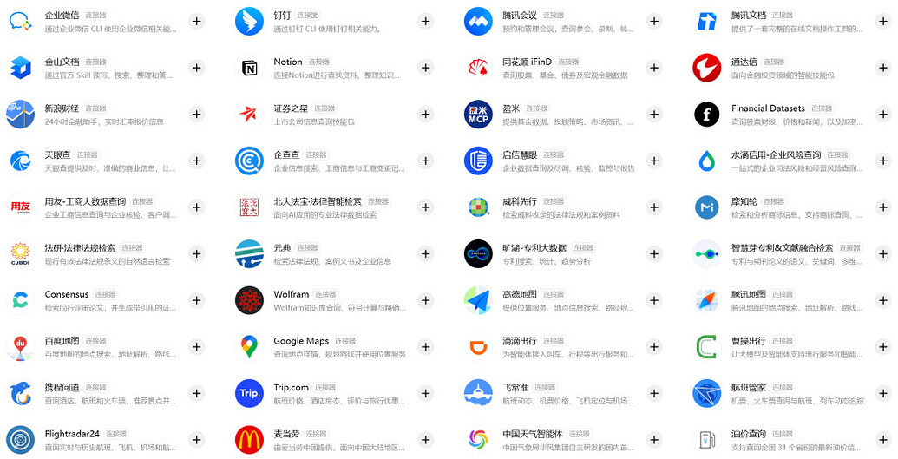
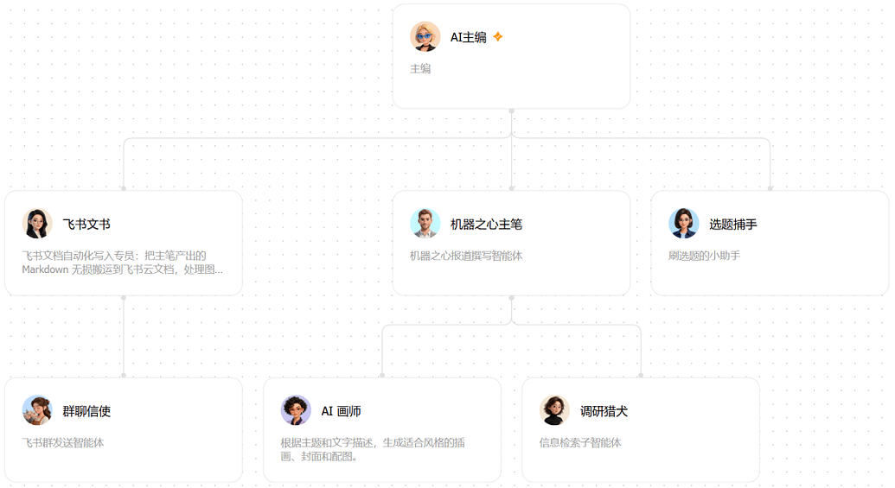
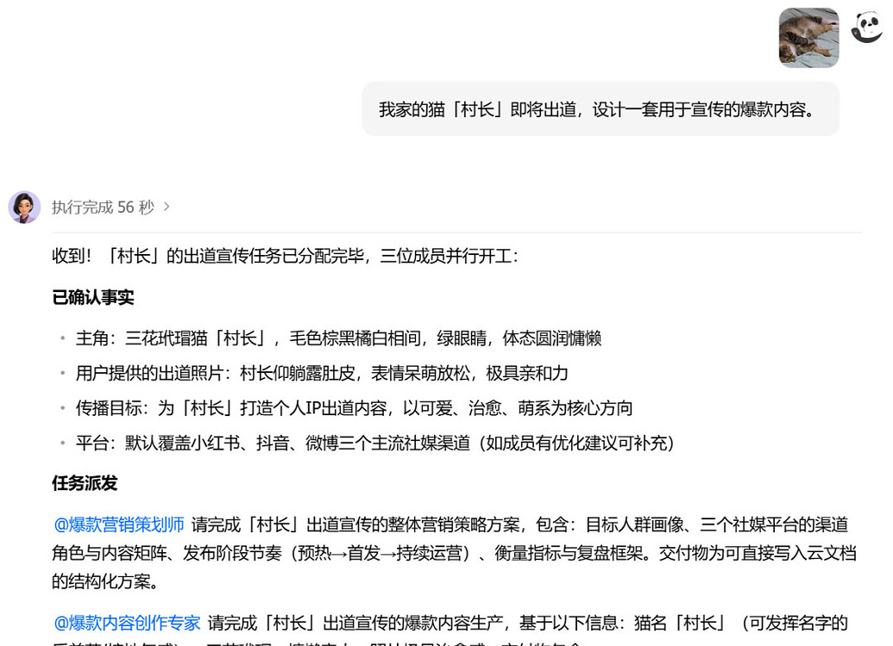

# 豆包介绍

## 豆包是什么？

豆包是字节跳动推出的 AI 助手，作为字节生态的入口，提供搜索、语音、音乐、图像等多模态交互能力。它面向日常通用问答和任务场景设计。

2026 年 8 月，豆包进一步升级为「会干活」的 AI：8 月 25 日正式发布面向生产力场景的办公 Agent 产品**豆包工作**，并整合字节旗下 TRAE Work、扣子的工作场景能力与飞书的企业协作上下文。

## 核心能力

- **生态集成**：连接字节跳动旗下服务和内容。
- **多模态交互**：支持文本、语音、图像和音乐。
- **搜索能力**：提供实时信息和答案。
- **日常助手**：适用于通用问答、写作和效率任务。
- **跨平台**：支持网页、移动端和桌面端。

## 豆包工作：办公 Agent

- **任务交付**：自主拆解任务、调用工具，完成文档、表格、PPT 及多媒体内容制作；交付物为可继续编辑的飞书文档 / PPT 文件，并同步生成演讲稿。
- **虚拟桌面**：在独立的 Windows 云环境中像人一样操作电脑和浏览器，不影响本机环境；支持本地 / 云电脑双模式；手机 App 可远程控制电脑，随时随地派发任务。
- **侧边工作台**：将本地文件、飞书文档、网页和代码集中到同一个工作空间。
- **技能商店与连接器**：内置 200+ 技能和连接器（企业微信、钉钉、腾讯会议、Notion、同花顺 iFinD 等），支持自定义技能，把常用流程沉淀为可复用模板。

- **工作伙伴 / 小队**：按需求选择不同专业方向的 Agent（如营销策划、内容创作、调研分析）组成小队协同工作；2026 年 9 月上线多 Agents 并行执行。

- **飞书打通**：在权限范围内调用企业文档、聊天记录、会议纪要等上下文，完成周报、解决方案、风险识别与经营分析等复杂工作。
- **多模态生成**：接入 Seedream / Seedance 模型，基于同一套素材生成风格统一的图片与宣传视频。

发布前一周（8 月 17–21 日），豆包以「日更」节奏连续上线手机远程控电脑、Windows 虚拟桌面、本地/云双模式、侧边工作台、技能商店等能力：

**模型与入口**：工作任务模式提供自动 / 豆包 2.1 Pro / 豆包 2.1 Turbo 三档选择；可通过独立 App、豆包 App 的工作任务区或飞书内直接调用。

## 快速上手

以下要点整理自社区指南 [DoubaoWorkGuide](https://github.com/AlephAITech/DoubaoWorkGuide)（[在线阅读](https://doubaowork.homes/)）：

- **下载安装**：只从官网 https://www.doubao.com/work 下载安装包（勿用网盘或来路不明的镜像）；macOS 拖入「应用程序」，Windows 按安装向导完成。支持手机号和飞书账号登录，注意两种登录方式的数据相互隔离。
- **跑通第一个任务**：左侧「新工作任务」，用「+」或「@ 添加资料」加入文件、文件夹或飞书云盘资料，还可以 @ 飞书联系人；底部按风险选择权限「始终询问 / 按需确认 / 全部允许」，模型一般保持 Auto 即可。验收时重点看四件事：事实有没有写错、数字能不能对上、待确认项有没有保留、格式能不能继续编辑。
- **Skill 机制**：Skill 是一组可复用的说明、脚本和模板（核心文件是 `SKILL.md`），遵循「渐进式披露」——Agent 启动时只加载各 Skill 的名称和描述，命中后才读取完整说明，参考资料和脚本按需再加载，避免大量无关指令塞满上下文。
- **API 与连接器的区别**：在自己的网站或应用里调用豆包大模型，用 API 服务（火山引擎）；想让豆包工作读取飞书、网页或其他业务系统，用连接器。
- **定时任务**：适合重复、规则稳定、结果好验收的工作（如资讯简报、周报草稿、竞品监控）；付款、发布、删除数据等操作不要交给无人值守流程。建议先手动跑通流程、结果合格后再定时，并定期抽查，规则变了就改提示词。
- **手机远程控制**：电脑端开启「手机遥控电脑」并保持设备唤醒，手机豆包 App 进入「工作任务」即可远程派发和监控电脑端任务。

> 图片来自「豆包工作」官方公众号及机器之心实测报道，仅作介绍引用。

## 访问方式

| 资源 | 链接 |
| --- | --- |
| 网页版 | https://www.doubao.com |
| 豆包工作 | https://www.doubao.com/work |
| 豆包 API | https://www.volcengine.com/product/doubao |

## 进阶参考

- [DoubaoWorkGuide](https://github.com/AlephAITech/DoubaoWorkGuide)：社区维护的「豆包工作蓝皮书」，含使用篇（安装登录、连接器、Skill、工作小队、手机控制、API、定时任务、多 Agent 等 12 篇）、入门篇与 5 类场景 31 个真实任务案例，[在线阅读](https://doubaowork.homes/)。

## 费用

提供免费版；付费计划和 API 按量计费可解锁更高额度和高级模型。
